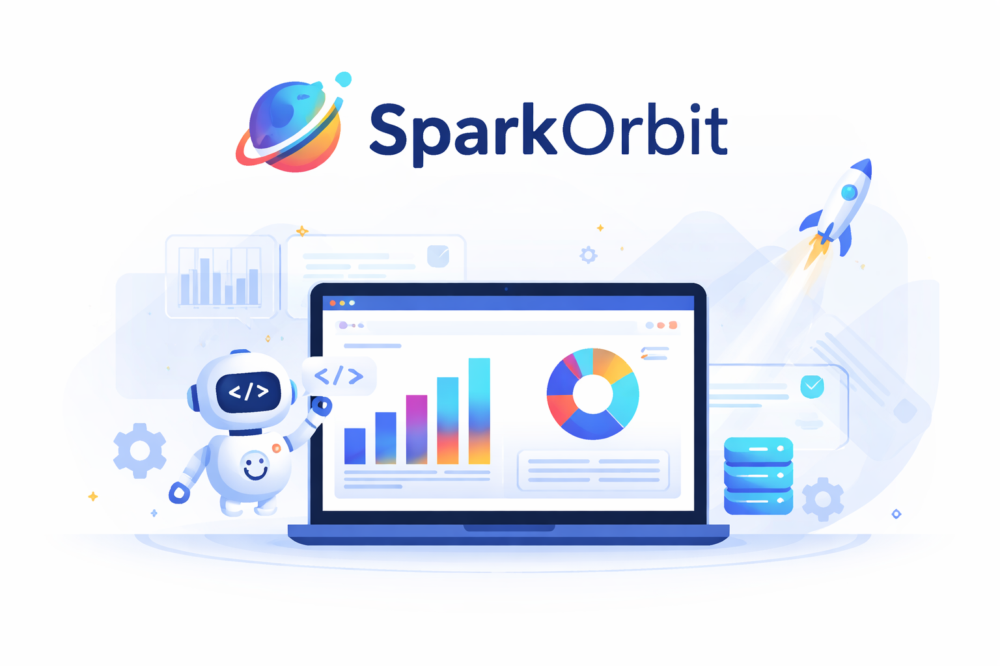
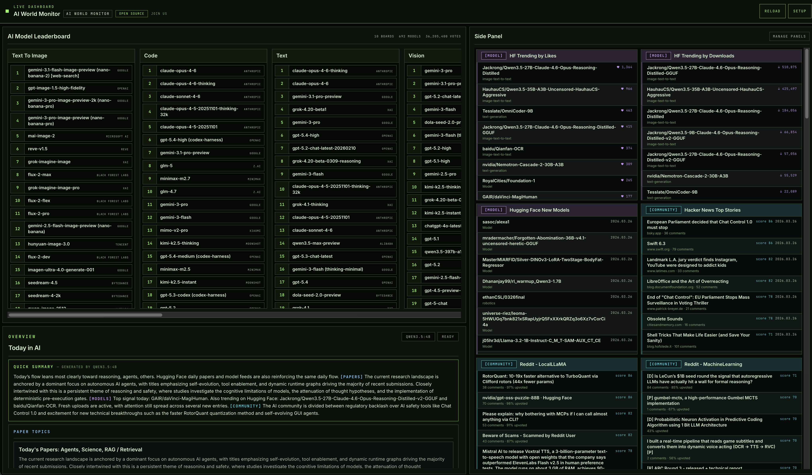
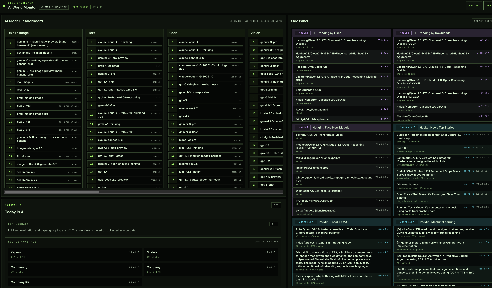

<h1 align="center">🛰️ SparkOrbit 🛰️</h1>
<p align="center">
  <br/>
  <b><i>✦ AI FOMO는 이제 그만 — 중요한 시그널만 궤도에서 포착하세요 ✦</i></b><br/>
  <b>논문, 모델, 벤치마크, 뉴스 — AI 정보를 하나의 대시보드에서.</b><br/>
  <sub>개인적인 해커톤 결과물입니다. Codex & Claude와 함께 만들었습니다. Keep going!</sub>
</p>

<p align="center">
    <a href="https://github.com/sparkorbit/sparkorbit/blob/main/LICENSE"></a>
    <a href="https://github.com/sparkorbit/sparkorbit/commits/main"></a>
    
    
    
    
</p>

<p align="center">
  <a href="./docs/README.ko.md">문서</a> · <a href="https://github.com/sparkorbit/sparkorbit/issues">이슈</a> · <a href="#contributing">기여하기</a>
</p>

<p align="center">
  <a href="./README.md">🇺🇸 English</a> · <a href="./README.ko.md">🇰🇷 한국어</a>
</p>

<p align="center">
  
</p>
- 프로젝트 화면

***

> **테스트 환경:** Linux, macOS에서 검증했고, Windows는 WSL 기준으로 부분 확인했습니다.
> 환경에 따라 예외가 있을 수 있어요 — [Known Issues](#known-issues) 참고
>
> **설치 없이 써보고 싶다면?** 브라우저에서 바로 접속할 수 있는 데모 서버를 고민 중입니다. 아직 확정은 아니에요.

***

## 🔭 What It Does - 뭘 할 수 있나요?

**AI [FOMO(Fear Of Missing Out)](https://en.wikipedia.org/wiki/Fear_of_missing_out)에 지치지 않으셨나요?** 매시간 쏟아지는 논문, 놓친 모델 릴리스, Big-Tech들이 공개하는 신기술, 뒤늦게 알게 된 벤치마크 변동 — 탭 지옥에서 벗어나세요. SparkOrbit이 한 화면에 다 모아주니까, 몇 분이면 최신 흐름을 파악할 수 있습니다.

- **수집** — 40개 이상의 소스에서 논문, 인기 모델, 주요 뉴스, 기업 소식을 한 번에 긁어옵니다. API 키도, 로그인도 필요 없습니다.
- **랭킹** — 좋아요, 다운로드, 별점, 스코어 순으로 정렬합니다. 단순한 "최신순"이 아닙니다.
- **비교** — Text, Code, Vision, Image, Video, Search 분야의 최신 모델 랭킹을 한눈에. **더이상 SoTA 찾으러 여기저기 돌아다닐 필요 없습니다.**
- **요약** — 로컬 LLM(Qwen 3.5 4B)이 수집된 내용을 읽고 데일리 브리핑과 논문 주제 분류를 만들어줍니다. GPU에서 돌아가고, 데이터는 내 컴퓨터 안에 남습니다.
- **한 줄이면 끝** — 명령어 하나로 실행. 나머지는 내부적으로 설계된 Docker가 알아서 합니다.
- **완전 오픈소스** — 포크하고, 확장하고, 소스를 추가해서 궤도를 넓혀보세요.


***

## 🚀 Quick Start

세 줄이면 됩니다.

```bash
git clone https://github.com/sparkorbit/sparkorbit.git
cd sparkorbit
bash scripts/docker-up.sh
```

**주의**

> ⚠️ Docker 환경을 확인하고, 설치 방법을 안내해줍니다.
>
> **⚠️ `Use local LLM bundle? [Y/n]`** — AI 요약 기능을 사용 유무 확인. GPU가 있으면 Y, 없으면 N.

| 선택 | 뭘 쓸 수 있나 | 필요한 것 |
|------|-------------|-----------|
| **Y** (기본값) | 전체 기능 — 오늘의 브리핑, 논문 주제 분류 등 | NVIDIA GPU, ~13GB VRAM |
| **N** | 소스 큐레이션만, 요약 없음 | Docker |

GPU 없어도 괜찮습니다 — LLM이 없어도 40개 이상의 소스, 리더보드, 인기 순위 전부 볼 수 있어요. AI 기능은 있으면 좋은 거지, 필수는 아닙니다.

실행되면 **http://localhost:3000** 으로 접속하세요. 원격 서버라면 서버 IP로 바꿔서 접속하면 됩니다.

<details>
<summary><b>스크린샷: GPU 있음 (전체 AI 기능)</b></summary>
<br/>
<p align="center">
  
</p>
</details>

<details>
<summary><b>스크린샷: GPU 없음 (소스 큐레이션만)</b></summary>
<br/>
<p align="center">
  
</p>
</details>

<br>

**종료하기**

```bash
bash scripts/docker-down.sh
```

안 쓸 때는 꺼두고, 다시 쓸 때 `docker-up.sh`로 켜세요. 켜놓으면 리소스가 더 소비될 수 있습니다.

**업데이트**

```bash
git pull
bash scripts/docker-update.sh
```

오랜만에 다시 쓴다면, 실행 전에 `git pull`부터 하세요 — 언제 업데이트가 들어올지 모릅니다. `docker-update.sh`는 초기 설정 과정 없이 변경된 부분만 빌드하고, 이전에 선택한 LLM 모드를 그대로 사용합니다.

***

## ✨ Features

1.  — 오른쪽 상단 **RELOAD** 버튼을 누르면 모든 소스를 다시 수집하고 LLM 기능도 재실행됩니다. 소스들은 매일 갱신되니까, **하루에 한 번은 RELOAD를 눌러주세요.**

2.  — Side Panel의 **Manage Panels**에서 보고 싶은 정보만 골라서 표시하거나, 패널 순서를 바꿀 수 있습니다.

3.  — LLM 처리가 끝나면 팝업이 자동으로 뜹니다. 확인하면 요약, arxiv 도메인 분류, Side Panel 논문 섹션에 도메인별 소제목이 나타납니다.

***

## 🧩 Tech Stack & Documentation

기술 스택과 문서는 **[docs/README.md](./docs/README.md)** 에서 확인하세요.

***

## 👥 Contributors

<div align="center">
<table>
  <tr>
    <td align="center" width="160">
      <a href="https://github.com/dlsghks1227">
        
      </a><br/>
      <b>Inhwan</b><br/>
      <sub>@dlsghks1227</sub>
    </td>
    <td align="center" width="160">
      <a href="https://github.com/jjunsss">
        
      </a><br/>
      <b>jjunsss</b><br/>
      <sub>@jjunsss · <a href="https://jjunsss.github.io/">BLOG</a></sub>
    </td>
  </tr>
</table>
</div>

<p align="center">소스 어댑터 추가, UI 개선, 오타 수정 — 어떤 기여든 환영합니다.</p>

***

## 🤝 Contributing

> **PR 및 기여 프로세스 문서는 준비 중입니다.**

- 지금은 fork → branch → PR로 보내주세요. 리뷰 후 머지합니다.

- 코딩 에이전트(Codex, Claude, Cursor 등) 사용 완전 환영합니다 — 이 프로젝트도 그렇게 만들었으니까요 :)
궁금한 게 있으면 [이슈](https://github.com/sparkorbit/sparkorbit/issues) 편하게 남겨주세요.

***

## ⚠️ Known Issues

- **LLM이 불안정할 수 있습니다** — Ollama 기반 로컬 LLM은 GPU나 VRAM 상태에 따라 멈추거나 이상한 결과를 낼 수 있습니다. 그럴 땐 도커를 내리고 `bash scripts/docker-up.sh --without-llm`으로 다시 올려보세요. 핵심 대시보드는 LLM 없이도 잘 돌아갑니다. 안정성은 계속 개선하고 있어요.
- **플랫폼 이슈** — Linux, macOS에서는 전체 테스트를 마쳤고, Windows는 WSL에서만 부분 확인했습니다. Docker 버전이나 네트워크 설정에 따라 문제가 생길 수 있어요. 뭔가 이상하면 [이슈](https://github.com/sparkorbit/sparkorbit/issues) 남겨주세요 — 빠르게 확인하겠습니다.

***

<details>
<summary><b>이 프로젝트를 찾으려면 뭘 검색하면 되나요?</b></summary>
<br/>

SparkOrbit은 **AI 대시보드**, **AI 뉴스 수집기**, **arXiv 논문 트래커**, **HuggingFace 트렌딩 뷰어**, **LLM 리더보드 대시보드**, **AI 연구 피드 리더**입니다.

아래 키워드로 찾아오셨다면, 잘 오셨습니다:

`ai dashboard` · `ai monitor` · `ai news aggregator` · `arxiv paper tracker` · `huggingface trending` · `llm leaderboard` · `ai research feed` · `machine learning news` · `deep learning dashboard` · `ai info dashboard` · `paper summarizer` · `model ranking` · `ai tool` · `open source ai dashboard` · `ollama dashboard` · `lmarena` · `ai benchmark tracker` · `nlp news` · `computer vision papers` · `ai community feed`

</details>

***

## 🙏 Acknowledgments

- [**WorldMonitor**](https://github.com/koala73/worldmonitor) — 올인원 모니터링 대시보드라는 아이디어의 시작점입니다. 이 컨셉을 AI 쪽으로 가져오면서 SparkOrbit이 시작됐습니다.

***

<p align="center">
  <i>For the AI orbit.</i> 🛰️
</p>
