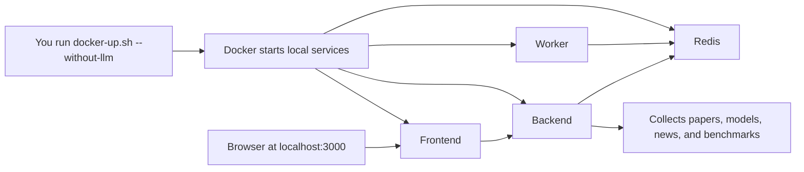

[Index](./README.md) · **00. Getting Started (No GPU)** · [06. Operational Playbook](./06_operational_playbook.md)

---

# SparkOrbit - 00. Getting Started (No GPU)

> Beginner-first local setup guide
> Last updated: 2026-03-27

This guide is for people who want the easiest first run.

- You do not need an NVIDIA GPU.
- You do not need local AI summarization to try SparkOrbit.
- You can get the dashboard running first, then decide later whether you want the GPU-powered LLM features.

The canonical runbook is still [06. Operational Playbook](./06_operational_playbook.md). This document is the simplified no-GPU path for first-time users.
This exact flow uses the Bash-based Linux/macOS path. On Windows, Docker Desktop / WSL behavior can differ.

## 1. What You Get In No GPU Mode

No GPU mode still gives you the main SparkOrbit experience:

- papers, models, community, company, and benchmark panels
- live collection from 30+ public sources
- ranking, drill-down, and the reload button to fetch fresh data again

What is skipped:

- AI-generated summaries
- paper topic classification
- daily briefing powered by a local LLM

<p align="center">
  
</p>

## 2. Before You Start

This guide assumes:

- **OS:** Linux or macOS
- **Docker:** installed and currently running
- **Git:** installed, or you are comfortable downloading the repo ZIP from GitHub
- **Internet:** available for the first build and data collection
- **Terminal:** you can open a terminal window and paste commands

Helpful quick checks:

```bash
docker --version
docker compose version
git --version
```

If Docker commands fail:

- macOS: open Docker Desktop and wait until it says Docker is running
- Linux: make sure your Docker daemon or service is running

If `git --version` fails, install Git first or download the repository as a ZIP from GitHub.

Ports used by the local stack:

- `3000` for the frontend dashboard
- `8787` for the backend API
- `6380` for Redis on your host

## 3. Step-By-Step First Run

### Step 1. Start Docker and wait until it is ready

If Docker is not already running:

- macOS: open Docker Desktop and wait until it finishes starting
- Linux: start your Docker daemon or service, then continue

### Step 2. Open a terminal

You will run three short commands in the project folder.

### Step 3. Download the project

```bash
git clone https://github.com/sparkorbit/sparkorbit.git
cd sparkorbit
```

If you do not want to use Git, download the repository ZIP from GitHub, unzip it, and open that folder in your terminal instead.

### Step 4. Start SparkOrbit in no-GPU mode

```bash
bash scripts/docker-up.sh --without-llm
```

What this means:

- `bash` runs the helper script
- `docker-up.sh` starts the local app stack
- `--without-llm` tells SparkOrbit to skip the GPU-only local AI features

### Step 5. Wait for the first build

On the first run, Docker may need a few minutes to:

- pull base images
- build the frontend and backend containers
- start Redis, backend, worker, and frontend

If the terminal is still printing build logs, that is normal.
You should eventually see:

```text
✓ All containers started successfully.
```

### Step 6. Open the dashboard

Open this address in your browser:

```text
http://localhost:3000
```

If you are running on a remote machine, use:

```text
http://<server-ip>:3000
```

### Step 7. Let the first collection finish

After the page opens, SparkOrbit may show a loading screen while it:

- collects source data
- saves the collected data for this run
- makes the dashboard ready in your browser

This is expected on the first run.

### Step 8. If the page does not load, check service status first

```bash
docker compose ps
```

Then check backend health:

```bash
curl http://127.0.0.1:8787/api/health
```

Expected response:

```json
{"ok":true,"backend":"fastapi"}
```

## 4. What Is Happening Behind The Scenes



In this guide, the optional Ollama / local LLM path is intentionally not used.

## 5. Words You Might See

- **Docker**: the tool that runs the app in isolated local services.
- **Docker Compose**: the Docker command that starts several services together.
- **image**: a packaged template used to create a running container.
- **container**: a running service, such as the frontend or backend.
- **frontend**: the web UI you open in the browser.
- **backend**: the API server that collects data and serves the dashboard.
- **worker**: the background service that handles queued runtime work.
- **Redis**: the fast local store used for session and dashboard state.
- **LLM**: a local AI model used only for optional summary features.
- **No GPU mode**: the simpler mode that skips those optional LLM features.

## 6. Common Problems

### `docker: command not found`

Docker is not installed, or your shell cannot find it yet.

Try:

- install Docker
- restart your terminal
- run `docker --version` again

### Docker is installed, but commands still fail

Docker may not be running yet.

Try:

- open Docker Desktop or start your Docker runtime
- wait until Docker shows it is ready
- run `docker compose version`

### `localhost:3000` does not open

The most common reasons are:

- the containers are still building
- another local app is already using port `3000`
- the backend failed before the UI finished loading

Useful checks:

```bash
docker compose ps
curl http://127.0.0.1:8787/api/health
```

### The loading screen stays for a while

That is normal on first run.

SparkOrbit is collecting data from many sources, so the first session can take a bit longer than a simple static web app.

### I do not see AI summaries

That is expected in this guide.

This document uses `--without-llm`, so summary features are intentionally turned off.

## 7. Stop, Start Again, And Check Status

Stop everything:

```bash
docker compose down
```

Start again in no-GPU mode:

```bash
bash scripts/docker-up.sh --without-llm
```

Check which services are running:

```bash
docker compose ps
```

## 8. Where To Go Next

- If you want the full technical runbook, read [06. Operational Playbook](./06_operational_playbook.md).
- If you want the architecture overview, read [01. Overall Flow](./01_overall_flow.md).
- If you later want local AI summaries and you have an NVIDIA GPU, go back to the main [README](../README.md) and use `--with-llm`.
