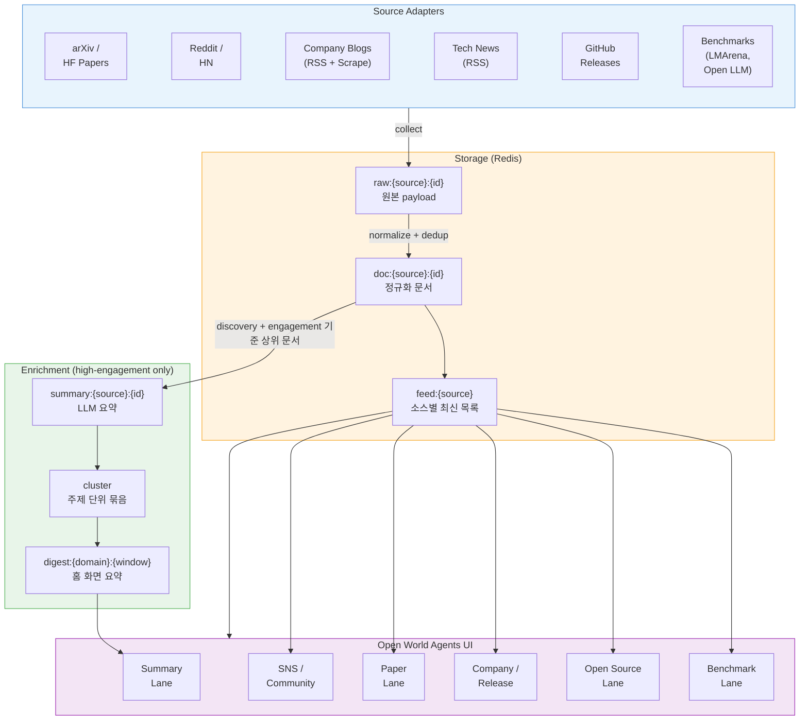

[Index](./README.md) · **01. Overall Flow** · [02. Sections](./02_sections/README.md) · [02.1 Sources](./02_sections/02_1_sources.md) · [03. Runtime Flow Draft](./03_runtime_flow_draft.md) · [04. LLM Usage](./04_llm_usage.md) · [05. Data Collection Pipeline](./05_data_collection_pipeline.md)

---

# SparkOrbit Docs - 01. Overall Flow

> Canonical overview
> Last updated: 2026-03-24

## Current Status

<!-- ────────────────────────────────────────────
     "지금 뭐가 돌아가고 있는가"를 먼저 명확히 한다.
     아래의 전체 아키텍처 그림은 목표 상태이고,
     현재 실제로 실행 가능한 것은 여기에 적는다.
     ──────────────────────────────────────────── -->

현재 저장소에서 실제로 구현된 것:

| 단계 | 코드 위치 | 상태 |
|------|-----------|------|
| **데이터 수집** | `PoC/source_fetch/` | 구현 완료 — 40+ source에서 수집 → normalized documents.ndjson |
| **Company filter** | `PoC/llm_enrich/scripts/llm_enrich.py` | 구현 완료 — company 계열 문서 keep/drop + domain 분류 |
| **Paper domain 분류** | `PoC/llm_enrich/scripts/paper_enrich.py` | 구현 완료 — 논문을 22개 연구 분야로 분류 |

- 아래의 Redis, digest, cluster, `docker compose up` 기반 전체 구조는 제품 목표와 target architecture 설명이다.
- 구현된 수집 경로는 [05. Data Collection Pipeline](./05_data_collection_pipeline.md) 을, LLM enrichment는 [04. LLM Usage](./04_llm_usage.md) 를 기준으로 본다.

## What We Are Building

SparkOrbit는 AI/Tech 분야의 최신 정보를 **앱 시작 시 수집해 한 화면에 모아서 보여주는 Open World Agents 기반 인터페이스**다. 논문, 오픈소스, 기업 발표, 커뮤니티 반응, 벤치마크를 동시에 보고, LLM 요약을 통해 빠르게 훑은 뒤 원문까지 drill-down할 수 있어야 한다.

핵심은 "요약만 보여주는 화면"이 아니라, **요약 -> 관련 이벤트 -> 실제 문서와 링크**로 자연스럽게 이어지는 구조다.

## Screen Shape

| Lane | What the user sees | Main backing data |
|------|--------------------|-------------------|
| **Summary Lane** | domain headline, short digest, key change | `digest`, `cluster summary` |
| **SNS / Community Lane** | Reddit, HN, 공개 커뮤니티 반응 | source feed |
| **Paper Lane** | arXiv, HF paper, research update | source feed |
| **Company / Release Lane** | 회사 뉴스, changelog, release note | source feed |
| **Open Source Lane** | GitHub repo/release 변화 | source feed |
| **Benchmark Lane** | leaderboard, model comparison | benchmark snapshot |

## Architecture Diagram

**Drill-down 흐름:** `digest → cluster → document → original URL`

## User Flow

1. 앱이 시작되면 source별 데이터를 먼저 수집한다.
2. 홈 화면에서는 summary 카드와 source panel이 함께 보인다.
3. 사용자가 summary 카드를 누르면 해당 domain/event의 묶음이 열린다.
4. event를 누르면 관련 문서와 실제 URL이 source별로 펼쳐진다.
5. 사용자는 요약을 읽다가 바로 원문으로 들어가고, 관련 source 문서를 따라 drill-down하며 맥락을 확인한다.

## Operating Principles

1. 목표 상태에서는 `docker compose up` 후 바로 동작해야 한다.
2. 무료, 인증 없는 소스를 우선한다.
3. source feed는 섞지 않는다.
4. 여러 source를 묶는 일은 summary / cluster / digest 레이어에서만 한다.
5. 요약은 원문을 대체하지 않고 항상 원문 링크와 근거를 동반해야 한다.
6. 데이터는 세션 기반으로 보고, `Clear` 또는 날짜 변경 시 같은 실행 환경 안에서 다시 로딩한다.
7. 이 프로젝트는 대규모 운영 시스템보다 해커톤용 동작 가능한 흐름을 우선한다.
8. 크롤링 결과에는 `&amp;`, `&#39;`, `&nbsp;` 같은 HTML entity나 인코딩 깨짐이 섞일 수 있다고 가정한다.
9. 따라서 `raw`에는 원본을 그대로 남기고, 화면/검색/요약용 `normalized` 레이어에서 entity decode와 공백 정리를 수행한다.
10. setup / run / verification 절차는 항상 Markdown runbook으로 관리하고, 실행 가능한 canonical 절차는 `06. Operational Playbook`에 남긴다.

## Document Map

- [02. Sections](./02_sections/README.md)
- [02.1 Sources](./02_sections/02_1_sources.md)
- [03. Runtime Flow Draft](./03_runtime_flow_draft.md)
- [04. LLM Usage](./04_llm_usage.md)
- [06. Operational Playbook](./06_operational_playbook.md)
- [07. Panel Instruction Packs](./07_panel_instruction_packs.md)

## Why The Docs Were Split

기존에는 source research와 runtime/storage draft가 한 파일 안에 같이 있었다. 지금 구조에서는:

- `01`은 제품 전체 흐름
- `02`는 화면/섹션 관점 정리
- `02.1`은 source research
- `03`은 아직 검토 중인 runtime / plan draft
- `04`는 LLM usage

로 역할을 분리해서, 나중에 정확도가 다른 내용이 서로 섞이지 않도록 관리한다.
