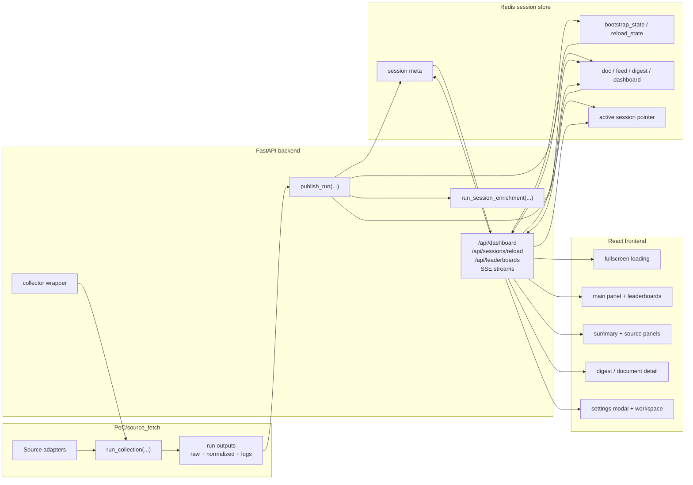

[Index](./README.md) · **01. Overall Flow** · [02. Sections](./02_sections/README.md) · [02.1 Sources](./02_sections/02_1_sources.md) · [03. Runtime Flow](./03_runtime_flow_draft.md) · [04. LLM Usage](./04_llm_usage.md) · [05. Data Collection Pipeline](./05_data_collection_pipeline.md) · [06. UI Design Guide](./06_ui_design_guide.md)

---

# SparkOrbit Docs - 01. Overall Flow

> Canonical overview
> Last updated: 2026-03-25

## Current Status

현재 저장소에는 아래 네 층이 함께 구현돼 있다.

| 층 | 코드 위치 | 상태 |
|----|-----------|------|
| **데이터 수집** | `PoC/source_fetch/` | 구현 완료 — 40+ source에서 수집 → normalized documents.ndjson |
| **세션 런타임** | `backend/app/` | 구현 완료 — FastAPI + Redis session publish + digest + SSE |
| **대시보드 UI** | `src/` | 구현 완료 — fullscreen loading, reload recovery, drill-down, workspace |
| **오프라인 enrichment** | `PoC/llm_enrich/` | 구현 완료 — company filter + paper domain |

- collection run output는 여전히 `PoC/source_fetch/data/runs/<run_id>/` 아래 JSONL/JSON 산출물이 canonical artifact다.
- Redis는 장기 저장소가 아니라 현재 세션을 빠르게 서빙하기 위한 materialized session layer다.
- `cluster / event / Ask Agent` 같은 상위 레이어는 아직 제품 목표 성격이 더 강하고, 현재 구현의 핵심은 `summary + source feed + document drill-down + live loading`이다.

## What We Are Building

SparkOrbit는 AI/Tech 분야의 최신 정보를 한 화면에서 빠르게 훑고, 바로 원문까지 drill-down할 수 있는 live monitor다. 논문, 모델, 커뮤니티, 기업 발표, 벤치마크를 함께 보되, source feed는 source별로 유지하고, 여러 source를 한 문맥으로 묶는 일은 summary/digest 레이어에서만 처리한다.

현재 구현의 중요한 특징은 아래 두 가지다.

1. 앱이 빈 상태로 뜨면 홈페이지 진입 시 backend가 실제 source collection을 시작한다.
2. frontend는 SSE로 bootstrap/reload 진행 상태를 실시간으로 받아 fullscreen loader와 stage panel에 반영한다.

## Current Screen Shape

| Surface | Status | Main backing data |
|---------|--------|-------------------|
| **Main Panel** | 구현됨 | session meta + leaderboard overview + reload state |
| **Summary Panel** | 구현됨 | `digest:{category}`, `dashboard.summary` |
| **Source Panels** | 구현됨 | `feed:{source}`, `doc:{document_id}` |
| **Digest Detail** | 구현됨 | `digest:{category}` + referenced documents |
| **Document Detail** | 구현됨 | `doc:{document_id}` |
| **Settings Modal** | 구현됨 | localStorage 기반 UI settings |
| **Ask / Agent Lane** | 목표 | digest + retrieval layer |

## Actual Runtime Shape

## User Flow

### Homepage Entry

1. 브라우저가 `/api/dashboard/stream?session=active`에 연결한다.
2. active session이 있으면 backend가 바로 current dashboard를 stream으로 보낸다.
3. active session이 없으면 backend가 `bootstrap_state`를 만들고 실제 collection을 시작한다.
4. frontend는 fullscreen loader에서 `Prepare -> Collect -> Normalize -> Publish Docs -> Publish Views -> Summarize -> Digests` 단계를 실시간으로 보여준다.
5. publish가 끝나면 active session이 교체되고, summary/digest가 채워지면서 일반 dashboard 화면으로 이어진다.

### Manual Reload

1. 사용자가 `reload session`을 누르면 `POST /api/sessions/reload`가 새 run을 시작한다.
2. frontend는 `/api/sessions/reload/stream`에 연결해 reload 전용 진행 상태를 받는다.
3. 새로고침하더라도 frontend가 `/api/sessions/reload` state를 다시 읽어 fullscreen loader를 복구한다.
4. reload가 끝나면 active session이 새 run으로 교체되고, dashboard SSE가 새 상태를 계속 반영한다.

### Drill-down

1. summary digest 클릭
2. `/api/digests/{id}` 호출
3. referenced documents 확인
4. 문서 클릭 시 `/api/documents/{document_id}` 호출
5. 필요하면 원문 URL 오픈

## Operating Principles

1. collection source of truth는 항상 JSONL run output이다.
2. Redis는 현재 세션을 빠르게 읽기 위한 서빙 계층이다.
3. source feed는 source별로 분리하고, cross-source mixing은 digest에서만 한다.
4. URL 없는 문서는 기본 서빙 대상에서 제외한다.
5. homepage와 reload는 둘 다 실제 source collection을 다시 실행할 수 있어야 한다.
6. 로딩 상태는 단순 spinner가 아니라 단계, 퍼센트, 현재 source를 보여주는 운영 콘솔 UX를 우선한다.
7. 이 프로젝트는 대규모 운영 시스템보다 해커톤용으로 바로 띄워서 볼 수 있는 흐름을 우선한다.

## Document Map

- [02. Sections](./02_sections/README.md)
- [02.1 Sources](./02_sections/02_1_sources.md)
- [02.2 Fields](./02_sections/02_2_fields.md)
- [03. Runtime Flow](./03_runtime_flow_draft.md)
- [04. LLM Usage](./04_llm_usage.md)
- [05. Data Collection Pipeline](./05_data_collection_pipeline.md)
- [06. UI Design Guide](./06_ui_design_guide.md)
- [06. Operational Playbook](./06_operational_playbook.md)
- [07. Panel Instruction Packs](./07_panel_instruction_packs.md)

## Why The Docs Were Split

- `01`은 제품 전체 흐름과 현재 구현 범위를 설명한다.
- `02.1`은 source 선정과 그룹을 관리한다.
- `02.2`는 normalized document contract를 관리한다.
- `03`은 backend, Redis, SSE, session serving 흐름을 설명한다.
- `05`는 collection pipeline 자체만 설명한다.
- `06 UI Design Guide`는 현재 프론트엔드의 시각, 로딩, workspace 규칙을 설명한다.

이렇게 나누는 이유는 `collection`, `runtime serving`, `UI design`을 한 문서에 섞지 않기 위해서다.
