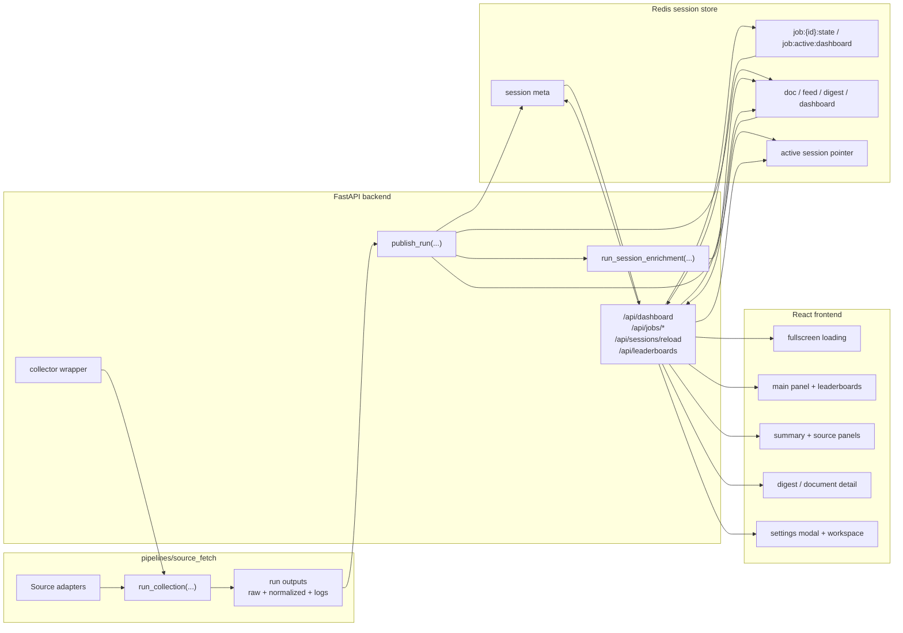

[Index](./README.md) · [🇰🇷 한국어](./01_overall_flow.ko.md) · **01. Overall Flow** · [02. Sections](./02_sections/README.md) · [02.1 Sources](./02_sections/02_1_sources.md) · [03. Runtime Flow](./03_runtime_flow_draft.md) · [04. LLM Usage](./04_llm_usage.md) · [05. Data Collection Pipeline](./05_data_collection_pipeline.md) · [06. UI Design Guide](./06_ui_design_guide.md)

---

# SparkOrbit Docs - 01. Overall Flow

> Canonical overview
> Last updated: 2026-03-27

## Current Status

The repository currently ships four implemented layers together.

| Layer | Code Location | Status |
|------|---------------|--------|
| **Data collection** | `pipelines/source_fetch/` | Implemented — fetches from 40+ sources into normalized `documents.ndjson` |
| **Session runtime** | `backend/app/` | Implemented — FastAPI + Redis session publish, digest generation, and progress polling |
| **Dashboard UI** | `src/` | Implemented — fullscreen loading, reload recovery, drill-down, workspace |
| **Offline LLM enrichment** | `pipelines/llm_enrich/` | Implemented — company filter and paper domain classification |

- Collection run outputs under `pipelines/source_fetch/data/runs/<run_id>/` remain the canonical JSONL/JSON artifacts.
- Redis is not treated as long-term storage. It is the materialized session layer used for fast serving.
- Higher-level ideas such as `cluster / event / Ask Agent` are still closer to product goals than current implementation. The implemented core is `summary + source feed + document drill-down + live loading`.

## What We Are Building

SparkOrbit is a live monitor for AI and tech signals. It is designed to let people scan papers, models, community signals, company announcements, and benchmarks from one screen, then drill directly into the original source. Source feeds stay separated by source, and cross-source mixing only happens in the summary and digest layer.

Two traits define the current implementation.

1. If the app opens with no active session, visiting the homepage triggers a real source-collection run.
2. The frontend polls Redis-backed job progress and reflects bootstrap and reload state in the fullscreen loader and stage panel.

## Current Screen Shape

| Surface | Status | Main backing data |
|---------|--------|-------------------|
| **Main Panel** | Implemented | session meta + leaderboard overview + reload state |
| **Summary Panel** | Implemented | `digest:{category}`, `dashboard.summary` |
| **Source Panels** | Implemented | `feed:{source}`, `doc:{document_id}` |
| **Digest Detail** | Implemented | `digest:{category}` + referenced documents |
| **Document Detail** | Implemented | `doc:{document_id}` |
| **Settings Modal** | Implemented | localStorage-based UI settings |
| **Ask / Agent Lane** | Target | digest + retrieval layer |

## Actual Runtime Shape

## User Flow

### Homepage Entry

1. The browser first requests `/api/jobs/active?surface=dashboard`.
2. If there is an active job, the frontend polls `/api/jobs/{job_id}` and keeps the fullscreen loader open.
3. If there is no active job, it requests `/api/dashboard?session=active`.
4. If there is no active session, a backend bootstrap thread creates Redis job state and starts a real collection run.
5. The loader shows `Prepare -> Collect Sources -> Write Artifacts -> Publish Docs -> Publish Views -> Summaries -> LLM Labels -> Digests -> Briefing`.
6. When the job reaches `ready` or `partial_error`, the frontend reloads the dashboard and returns to the normal screen.

### Manual Reload

1. When the user clicks `reload session`, `POST /api/sessions/reload` starts a new run.
2. The frontend polls `/api/jobs/{job_id}` using the returned `job_id`.
3. Even after a browser refresh, the frontend can recover the fullscreen loader by checking `/api/jobs/active?surface=dashboard` again.
4. When reload finishes, the active session is swapped to the new run and the frontend re-reads the dashboard and leaderboards.

### Drill-down

1. Click a summary digest.
2. Call `/api/digests/{id}`.
3. Inspect the referenced documents.
4. Click a document to call `/api/documents/{document_id}`.
5. Open the original reference URL when needed.

## Operating Principles

1. The collection source of truth is always the JSONL/JSON run output.
2. Redis is the serving layer for the current session, not the canonical artifact store.
3. Source feeds stay separated by source, and cross-source mixing happens only in digests.
4. Documents without displayable URLs are excluded from default serving.
5. Both homepage bootstrap and manual reload must be able to run a real collection again.
6. Loading state should behave like an operations console, not just a spinner. Stages, percent, and current source matter.
7. The project prefers an immediately runnable hackathon flow over large-scale production architecture.

## Document Map

- [02. Sections](./02_sections/README.md)
- [02.1 Sources](./02_sections/02_1_sources.md)
- [02.2 Fields](./02_sections/02_2_fields.md)
- [03. Runtime Flow](./03_runtime_flow_draft.md)
- [04. LLM Usage](./04_llm_usage.md)
- [05. Data Collection Pipeline](./05_data_collection_pipeline.md)
- [06. UI Design Guide](./06_ui_design_guide.md)
- [07. Panel Instruction Packs](./07_panel_instruction_packs.md)

## Why The Docs Were Split

- `01` explains the product-level flow and the current implementation scope.
- `02.1` manages source selection and source groups.
- `02.2` manages the normalized document contract.
- `03` explains backend, Redis, progress polling, and session serving.
- `05` focuses only on the collection pipeline itself.
- `06 UI Design Guide` explains the current frontend's visual language, loading behavior, and workspace rules.

The split exists so that `collection`, `runtime serving`, and `UI design` do not get mixed into one document.
