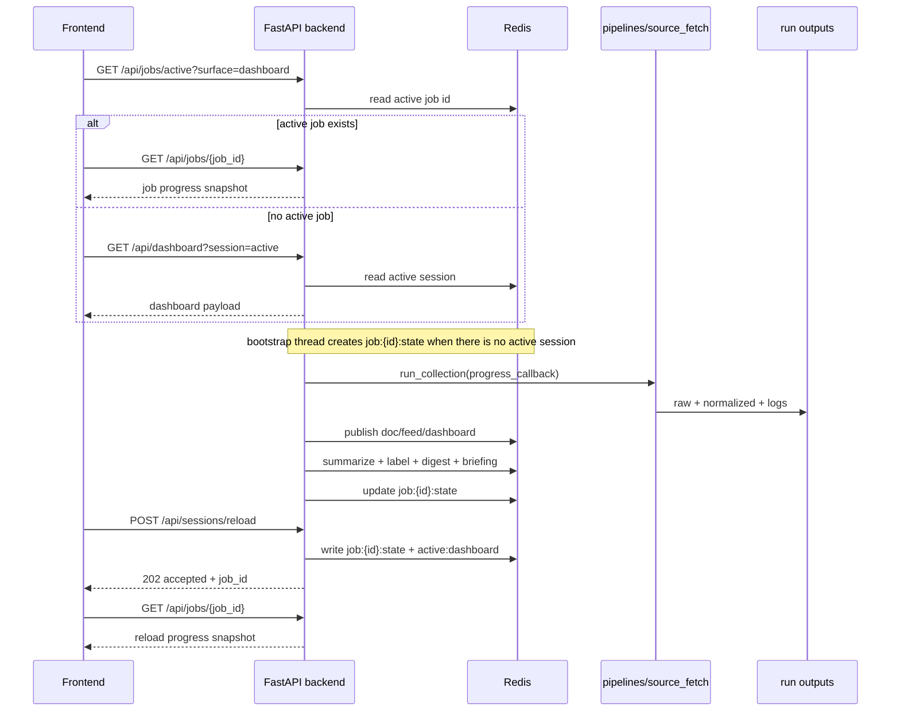

[Index](./README.md) · [🇰🇷 한국어](./03_runtime_flow.ko.md) · [01. Overall Flow](./01_overall_flow.md) · [02. Sections](./02_sections/README.md) · [02.1 Sources](./02_sections/02_1_sources.md) · **03. Runtime Flow** · [04. LLM Usage](./04_llm_usage.md) · [05. Data Collection Pipeline](./05_data_collection_pipeline.md) · [06. UI Design Guide](./06_ui_design_guide.md)

---

# SparkOrbit Docs - 03. Runtime Flow

> Current implemented backend and serving flow
> Last updated: 2026-03-27

> Note
> This document describes the real implemented flow across `backend/app`, Redis, and frontend polling.

## Purpose

This document explains the runtime flow that is actually implemented in the repository today.

- Source collection itself is documented in [05. Data Collection Pipeline](./05_data_collection_pipeline.md).
- This page focuses on how run outputs are published into Redis sessions and then served to the frontend.

## Current Components

| Component | Path | Role |
|----------|------|------|
| **collector wrapper** | `backend/app/services/collector.py` | Calls `run_collection(...)` from `pipelines/source_fetch` |
| **session runtime** | `backend/app/services/session_service.py` | Handles bootstrap, reload, publish, summarize, and dashboard rebuild |
| **summary provider** | `backend/app/services/summary_provider.py` | Provider abstraction for `noop` and `heuristic` summary behavior |
| **FastAPI app** | `backend/app/main.py` | Wires the app and `/api/*` routes |
| **dashboard routes** | `backend/app/api/routes/dashboard.py` | Serves dashboard, digest, and document payloads |
| **job routes** | `backend/app/api/routes/jobs.py` | Serves active-job lookup and progress polling |
| **session routes** | `backend/app/api/routes/sessions.py` | Starts reload runs |
| **leaderboard routes** | `backend/app/api/routes/leaderboards.py` | Serves leaderboard overview payloads |
| **Redis client** | `backend/app/core/store.py` | Provides the Redis-like abstraction and socket client |
| **React frontend** | `src/App.tsx` | Fetches dashboard state, polls jobs, and renders fullscreen loading |
| **dashboard workspace** | `src/components/dashboard/PanelWorkspace.tsx` | Renders the main, info, and summary layout |
| **docker compose** | `docker-compose.yml` | Runs `redis + backend + worker + frontend` locally |

## Source Of Truth

Adding runtime serving does not change the canonical artifacts.

1. `pipelines/source_fetch` writes run outputs under `pipelines/source_fetch/data/runs/<run_id>/`.
2. The backend reads those run outputs and publishes Redis session keys.
3. The frontend never reads JSONL run outputs directly. It only uses backend API responses.

In short:

```text
run output (JSONL/JSON) = source of truth
Redis session = serving / cache / live session layer
```

## End-to-End Flow



## Session Model

### Session Identity

- `session_id = run_id`
- The active pointer lives at `sparkorbit:session:active`

### Session Status

| Status | Meaning |
|--------|---------|
| `collecting` | Source fetch or publish is currently running |
| `published` | Document, feed, and dashboard payloads have been written to Redis |
| `summarizing` | Selected documents are being summarized and digests are being built |
| `ready` | Feed, digest, and session dashboard are ready |
| `partial_error` | Some summary work failed, but the session is still usable |
| `error` | Bootstrap or reload failed |
| `idle` | Reload-specific state meaning no reload is in progress |

### Loading Stages

The frontend and backend share the stage names below.

| Stage | Meaning |
|------|---------|
| `starting` | Initial setup after receiving the request |
| `fetching_sources` | Real source fetching is running |
| `writing_artifacts` | Normalized outputs, manifests, and logs are being written |
| `publishing_documents` | `doc:{document_id}` keys are being published |
| `publishing_views` | `feed:{source}`, `dashboard`, and `active` pointers are being updated |
| `summarizing_documents` | The summary provider is processing selected documents |
| `offline_labeling` | Coarser tasks such as company filtering and paper domains are running |
| `building_digests` | Category digests are being generated |
| `building_briefing` | Session briefing is being generated |
| `ready` | All stages finished successfully |
| `partial_error` | Finished with partial summary failures |
| `error` | Execution failed |

## Redis Model

### State Keys

| Key | TTL | Role |
|-----|-----|------|
| `sparkorbit:session:active` | none | Current active session id |
| `sparkorbit:session:recent` | none | Recent session id list used for rollover and pruning |
| `sparkorbit:job:{job_id}:state` | 15m | Progress snapshot for bootstrap, reload, or long tasks |
| `sparkorbit:job:active:{surface}` | 15m | Active blocking job id for a given surface |
| `sparkorbit:queue:session_enrich` | queue semantics | Queue consumed by the worker after a run is published |

### Session Keys

Retained session keys use a `72h` TTL. To keep Redis from growing without bound, rollover also prunes older sessions. The default retain count is `2` (`active + previous`) and can be changed with `SPARKORBIT_SESSION_RETAIN_COUNT`.

| Key pattern | Value |
|-------------|-------|
| `sparkorbit:session:{sid}:meta` | Session metadata plus the terminal loading snapshot |
| `sparkorbit:session:{sid}:run_manifest` | `run_manifest.json` |
| `sparkorbit:session:{sid}:source_manifest` | `source_manifest.ndjson` rows |
| `sparkorbit:session:{sid}:doc:{document_id}` | Normalized document plus `llm` block |
| `sparkorbit:session:{sid}:feed:{source}` | Ordered `document_id` list |
| `sparkorbit:session:{sid}:digest:{category}` | Category digest |
| `sparkorbit:session:{sid}:dashboard` | Frontend-ready materialized dashboard |

### What Redis Does Not Store

- Full `raw_responses` bodies
- Standalone `metrics.ndjson` rows
- A separate cluster or event layer

## Publish And Enrichment Rules

### Publish

1. Read the run outputs.
2. Keep only documents with displayable URLs.
3. Sort each source feed by `feed_score DESC`, then `sort_at DESC`.
4. Store every displayable document under its Redis doc key.
5. Store the source-level feed lists.
6. Update the materialized dashboard view and the active-session pointer.

### Summary Candidate Selection

- Maximum `8` items per category
- `summary_input_text` must not be empty
- `text_scope != empty`
- Ordering follows the same feed ordering used on screen

Documents that are not selected remain available for detail and drill-down, with `llm.status = "not_selected"`.

### Summary Provider

- Summary generation goes through the provider abstraction in `backend/app/services/summary_provider.py`.
- The default provider is `noop`.
- `SPARKORBIT_SUMMARY_PROVIDER=heuristic` enables the heuristic provider.
- A new LLM integration should be added as another provider implementation in the provider factory.

### Digest Scope

The currently implemented category digests are:

- `papers`
- `models`
- `community`
- `company`
- `company_kr`
- `company_cn`
- `benchmark`

There is no separate cluster or event layer yet.

## API Surface

### Standard JSON Endpoints

| Method | Path | Role |
|--------|------|------|
| `GET` | `/api/health` | Backend health |
| `GET` | `/api/dashboard?session=active|{id}` | Materialized dashboard payload |
| `GET` | `/api/leaderboards?session=active|{id}` | Leaderboard overview payload |
| `GET` | `/api/digests/{id}?session=...` | One digest plus referenced documents |
| `GET` | `/api/documents/{document_id}?session=...` | Full normalized document |
| `POST` | `/api/sessions/reload` | Start a new reload run |
| `GET` | `/api/jobs/active?surface=dashboard` | Active job lookup |
| `GET` | `/api/jobs/{job_id}` | Progress polling snapshot |

### SSE Streaming Endpoints

| Method | Path | Role |
|--------|------|------|
| `GET` | `/api/dashboard/stream` | Server-Sent Events stream for real-time dashboard updates |
| `GET` | `/api/jobs/{job_id}/stream` | Server-Sent Events stream for job progress tracking |

## Frontend Reading Rules

### Initial Load

1. On app start, the frontend first checks `/api/jobs/active?surface=dashboard` to see whether bootstrap or reload is already running.
2. If there is an active job, it polls `/api/jobs/{job_id}` every `1.5s`.
3. If there is no active job, it requests `/api/dashboard?session=active`.
4. The fullscreen loader renders the backend `loading` block as-is rather than recomputing it.

### Reload Resume

1. The user clicks `reload session`.
2. The frontend shows the fullscreen loader.
3. Reload progress polling starts.
4. Even after a browser refresh, the frontend restores state through `GET /api/jobs/active?surface=dashboard`.
5. When the job reaches `ready` or `partial_error`, the app returns to the normal dashboard.

### Drill-down

- Clicking a digest calls `/api/digests/{id}`.
- Clicking a source item calls `/api/documents/{document_id}` and opens the reference URL in a new tab.
- Leaderboards render from `session.arenaOverview` or the `/api/leaderboards` response.

## Display Time Contract

Frontend time labels should not be derived by reinterpreting raw fields on the client. The backend serving layer first resolves a display-time contract per document based on `time_semantics`, and the frontend renders that resolved value.

- Source feed items receive both `timestamp` and `timestampLabel`.
- `/api/documents/{document_id}` includes `display_time = { label, value, field, semantics }`.
- A `published` source shows `Published`.
- A `created` source shows `Created`.
- An `updated` source shows `Updated`.
- A `submission` source shows `Submitted`.
- A `snapshot` source shows `Snapshot`.
- A pure `fetched_at` fallback shows `Observed`.

Operational rules:

1. `sort_at` is a sorting fallback, not a human-facing `Published` label.
2. Sources with `updated` semantics should keep `published_at` empty when needed to avoid misleading `Published` labels.
3. Source panels, digest related items, and document detail should resolve display time the same way.
4. When adding a new source, verify that adapter `time_semantics` and dashboard/document time labels still match.

Current panel checklist:

- Source feed panels should only use `feed.items[].timestamp` and `feed.items[].timestampLabel`.
- The document detail panel should use `document.display_time` as the primary value and only show `updated_at` separately when it adds new information.
- The digest detail panel should use `digest.updatedAt` for the digest header and each related document's `display_time` for the document list.
- The leaderboard panel should not directly show source-document time values. Benchmark snapshots should only appear as `Snapshot` in document detail.

## Loading UX Contract

The backend sends live progress to the frontend in the shape below.

```json
{
  "stage": "fetching_sources",
  "stage_label": "Collect Sources",
  "detail": "Fetching reddit_machinelearning (4/18).",
  "percent": 22,
  "source_counts": { "completed": 3, "total": 18, "active": 6, "error": 0, "skipped": 0 },
  "current_work_item": { "kind": "source", "id": "reddit_machinelearning", "label": "reddit_machinelearning" },
  "active_work_items": [
    { "kind": "source", "id": "reddit_machinelearning", "label": "reddit_machinelearning" }
  ],
  "steps": [
    { "id": "prepare", "label": "Prepare", "status": "complete" },
    { "id": "collect", "label": "Collect", "status": "active" }
  ]
}
```

The frontend should use this payload directly rather than trying to recalculate it.

## Worker Role

`docker compose` includes a `worker` service as well.

- When queue-based flows are used, such as manual publish flows, the worker consumes `sparkorbit:queue:session_enrich`.
- Homepage bootstrap and manual reload currently run enrichment directly inside an API background task.

That makes the worker closer to an optional sidecar in the current architecture.

## Current Constraints

- Live updates use Redis state plus HTTP polling, not Redis pub/sub.
- Bootstrap and reload are guarded by a process-local lock so only one runs at a time.
- Browser refresh protection uses both a `beforeunload` warning and reload-state recovery.
- Because the default summary provider is `noop`, digests can look placeholder-heavy unless another provider is enabled.

## Relationship To Other Docs

- Source selection: [02.1 Sources](./02_sections/02_1_sources.md)
- Normalized field contract: [02.2 Fields](./02_sections/02_2_fields.md)
- Collection orchestration: [05. Data Collection Pipeline](./05_data_collection_pipeline.md)
- Current screen and loading rules: [06. UI Design Guide](./06_ui_design_guide.md)
