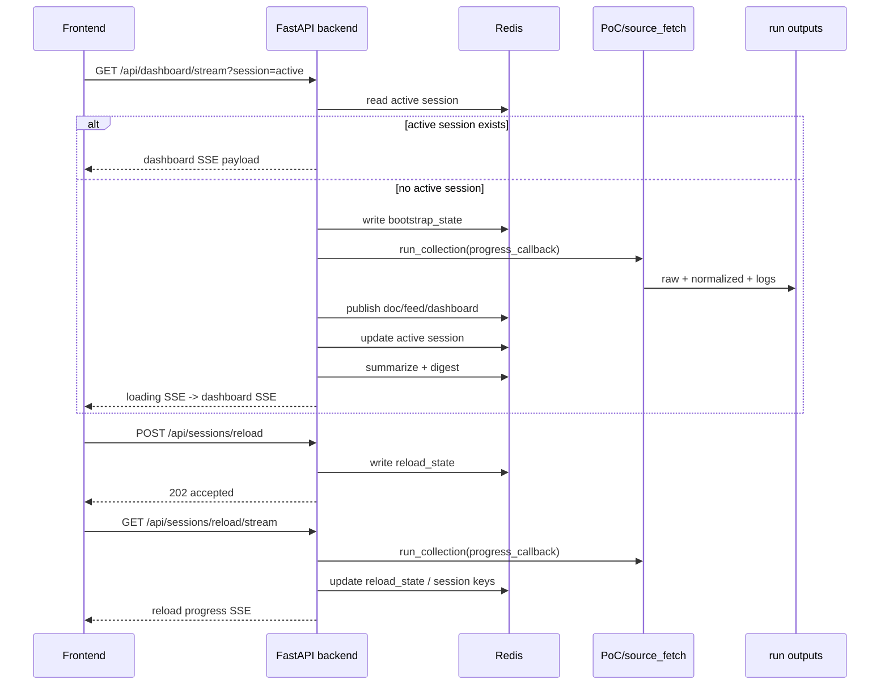

[Index](./README.md) · [01. Overall Flow](./01_overall_flow.md) · [02. Sections](./02_sections/README.md) · [02.1 Sources](./02_sections/02_1_sources.md) · **03. Runtime Flow** · [04. LLM Usage](./04_llm_usage.md) · [05. Data Collection Pipeline](./05_data_collection_pipeline.md) · [06. UI Design Guide](./06_ui_design_guide.md)

---

# SparkOrbit Docs - 03. Runtime Flow

> Current implemented backend / serving flow
> Last updated: 2026-03-25

> Note
> 파일명은 `_draft`를 유지하지만, 현재 내용은 실제 구현된 `backend/app + Redis + frontend stream` 흐름을 설명한다.

## Purpose

이 문서는 현재 저장소에 실제로 구현된 `backend/app + Redis + frontend stream` 흐름을 설명한다.

- source 수집 자체는 [05. Data Collection Pipeline](./05_data_collection_pipeline.md)에 정리한다.
- 여기서는 그 run output를 어떻게 Redis session으로 publish하고, frontend가 어떻게 읽는지에 집중한다.

## Current Components

| Component | Path | Role |
|----------|------|------|
| **collector wrapper** | `backend/app/services/collector.py` | `PoC/source_fetch`의 `run_collection(...)` 호출 |
| **session runtime** | `backend/app/services/session_service.py` | bootstrap, reload, publish, summarize, dashboard rebuild |
| **summary provider** | `backend/app/services/summary_provider.py` | `noop` / `heuristic` provider abstraction |
| **FastAPI app** | `backend/app/main.py` | `/api/*` 라우터와 app wiring |
| **dashboard routes** | `backend/app/api/routes/dashboard.py` | dashboard, digest, document, dashboard SSE |
| **session routes** | `backend/app/api/routes/sessions.py` | reload start, state, reload SSE |
| **leaderboard routes** | `backend/app/api/routes/leaderboards.py` | leaderboard overview 응답 |
| **Redis client** | `backend/app/core/store.py` | RedisLike abstraction + socket client |
| **React frontend** | `src/App.tsx` | dashboard stream, reload stream, fullscreen loading |
| **dashboard workspace** | `src/components/dashboard/PanelWorkspace.tsx` | main, info, summary layout |
| **docker compose** | `docker-compose.yml` | `redis + backend + worker + frontend` local runtime |

## Source Of Truth

runtime이 붙어도 canonical artifact는 바뀌지 않는다.

1. `PoC/source_fetch`가 `PoC/source_fetch/data/runs/<run_id>/` 아래 run output를 만든다.
2. backend는 이 run output를 읽어 Redis session 키를 만든다.
3. frontend는 JSONL run output를 직접 읽지 않고 backend API/BFF만 사용한다.

즉:

```text
run output(JSONL/JSON) = source of truth
Redis session = serving / cache / live session layer
```

## End-to-End Flow



## Session Model

### Session Identity

- `session_id = run_id`
- active pointer는 `sparkorbit:session:active`

### Session Status

| Status | Meaning |
|--------|---------|
| `collecting` | source fetch 또는 publish 직전/직후 단계 진행 중 |
| `published` | doc/feed/dashboard가 Redis에 올라간 상태 |
| `summarizing` | 선택 문서 요약과 digest 생성 중 |
| `ready` | feed + digest + session dashboard 준비 완료 |
| `partial_error` | 일부 요약은 실패했지만 session은 usable |
| `error` | bootstrap 또는 reload 실행 중 오류 |
| `idle` | reload state 전용. 현재 진행 중인 reload 없음 |

### Loading Stages

frontend와 backend는 아래 stage 이름을 공유한다.

| Stage | Meaning |
|------|---------|
| `starting` | 요청 수신 후 준비 단계 |
| `fetching_sources` | source별 실제 fetch 진행 |
| `writing_artifacts` | normalized, manifest, log 기록 |
| `publishing_documents` | `doc:{document_id}` publish |
| `publishing_views` | `feed:{source}`, `dashboard`, `active` 갱신 |
| `published` | publish 완료, summary 대기 |
| `summarizing_documents` | 선택 문서 summary provider 실행 |
| `building_digests` | category digest 생성 |
| `ready` | 모든 단계 완료 |
| `partial_error` | 일부 summary 실패 후 종료 |
| `error` | 실행 실패 |

## Redis Model

### State Keys

| Key | TTL | Role |
|-----|-----|------|
| `sparkorbit:session:active` | none | 현재 active session id |
| `sparkorbit:session:bootstrap_state` | 15m | 홈페이지 최초 진입 bootstrap 진행 상태 |
| `sparkorbit:session:reload_state` | 15m | manual reload 진행 상태 |
| `sparkorbit:queue:session_enrich` | queue semantics | existing run publish 후 worker가 읽는 큐 |

### Session Keys

모든 세션 키는 `72h` TTL을 가진다.

| Key pattern | Value |
|-------------|-------|
| `sparkorbit:session:{sid}:meta` | session meta + loading stage + counts |
| `sparkorbit:session:{sid}:run_manifest` | `run_manifest.json` |
| `sparkorbit:session:{sid}:source_manifest` | `source_manifest.ndjson` rows |
| `sparkorbit:session:{sid}:doc:{document_id}` | normalized document + `llm` block |
| `sparkorbit:session:{sid}:feed:{source}` | ordered `document_id` list |
| `sparkorbit:session:{sid}:digest:{category}` | category digest |
| `sparkorbit:session:{sid}:dashboard` | frontend-ready materialized dashboard |

### What Redis Does Not Store

- `raw_responses` body 전체
- standalone `metrics.ndjson` rows
- separate cluster/event layer

`source_manifest` 안의 `sample_path`는 collection artifact 메타데이터로 남아 있을 수 있지만, frontend가 sample fixture를 읽는 구조는 아니다.

## Publish / Enrichment Rules

### Publish

1. run output를 읽는다.
2. displayable URL이 있는 문서만 남긴다.
3. `feed_score DESC`, `sort_at DESC`로 source feed를 정렬한다.
4. 모든 displayable document를 Redis doc key에 저장한다.
5. source별 feed list를 저장한다.
6. dashboard materialized view와 active pointer를 갱신한다.

### Summary Candidate Selection

- category별 최대 `8개`
- `summary_input_text`가 비어 있지 않아야 함
- `text_scope != empty`
- 정렬은 feed ordering과 동일

선택되지 않은 문서는 `llm.status = "not_selected"`로 남고, detail/drill-down에는 그대로 사용된다.

### Summary Provider

- summary 생성은 `backend/app/services/summary_provider.py`의 provider abstraction을 사용한다.
- 기본 provider는 `noop`이고, `SPARKORBIT_SUMMARY_PROVIDER=heuristic`으로 휴리스틱 provider를 선택할 수 있다.
- 새로운 LLM 연동은 provider factory에 구현체를 추가하는 방식으로 붙인다.

### Digest Scope

현재 구현된 category digest는 아래 7개다.

- `papers`
- `models`
- `community`
- `company`
- `company_kr`
- `company_cn`
- `benchmark`

cluster/event 레이어는 아직 없다.

## API Surface

### Standard JSON Endpoints

| Method | Path | Role |
|--------|------|------|
| `GET` | `/api/health` | backend health |
| `GET` | `/api/dashboard?session=active|{id}` | materialized dashboard |
| `GET` | `/api/leaderboards?session=active|{id}` | leaderboard overview |
| `GET` | `/api/digests/{id}?session=...` | one digest + referenced documents |
| `GET` | `/api/documents/{document_id}?session=...` | full normalized document |
| `GET` | `/api/sessions/reload` | current reload state |
| `POST` | `/api/sessions/reload` | new reload run start |

### SSE Endpoints

| Method | Path | Role |
|--------|------|------|
| `GET` | `/api/dashboard/stream?session=active|{id}` | homepage bootstrap + active dashboard live updates |
| `GET` | `/api/sessions/reload/stream` | reload progress live updates |

frontend는 기본적으로 SSE를 우선 사용하고, 필요할 때만 JSON fallback을 사용한다.

## Frontend Reading Rules

### Initial Load

1. 앱 시작 시 `reload_state`를 먼저 확인해 ongoing reload가 있는지 본다.
2. 없으면 dashboard SSE에 연결한다.
3. active session이 없으면 backend가 bootstrap을 자동 시작한다.
4. fullscreen loader는 SSE payload의 `loading` block을 그대로 렌더링한다.

### Reload Resume

1. `reload session` 버튼 클릭
2. fullscreen loader 표시
3. reload SSE 수신
4. 브라우저 새로고침 시에도 `GET /api/sessions/reload`로 state를 복구
5. `ready` 또는 `partial_error`가 되면 일반 dashboard로 복귀

### Drill-down

- digest 클릭 시 `/api/digests/{id}`를 호출한다.
- source item 클릭 시 `/api/documents/{document_id}`를 호출하고, reference URL을 새 탭으로 연다.
- leaderboards는 `session.arenaOverview` 또는 `/api/leaderboards` 응답을 메인 패널에서 렌더링한다.

## Loading UX Contract

backend는 모든 live progress를 아래 모양으로 frontend에 내려준다.

```json
{
  "stage": "fetching_sources",
  "stageLabel": "Source 수집",
  "detail": "Fetching reddit_machinelearning (4/18).",
  "progressCurrent": 3,
  "progressTotal": 18,
  "percent": 22,
  "currentSource": "reddit_machinelearning",
  "steps": [
    { "id": "prepare", "label": "Prepare", "status": "complete" },
    { "id": "collect", "label": "Collect", "status": "active" }
  ]
}
```

frontend는 이 값을 재계산하지 않고 가능한 그대로 사용한다.

## Worker Role

`docker compose`에는 `worker`도 포함돼 있다.

- manual `publish` CLI처럼 queue 기반 흐름을 쓸 때는 worker가 `sparkorbit:queue:session_enrich`를 소비한다.
- homepage bootstrap과 manual reload는 현재 API background task 안에서 enrichment까지 바로 처리한다.

즉 worker는 현재 구조에서 optional sidecar에 가깝다.

## Current Constraints

- Redis pub/sub가 아니라 Redis state + SSE polling loop로 live update를 구현한다.
- reload와 bootstrap은 한 번에 하나만 돌도록 process-local lock을 둔다.
- 새로고침 방지는 브라우저 제한이 있어 `beforeunload` 경고 + reload state 복구를 함께 사용한다.
- summary provider 기본값은 `noop`이라 외부 모델을 붙이지 않으면 digest는 placeholder/heuristic 중심으로 보일 수 있다.
- sample preview 파일은 collection artifact에 남지만 frontend data source는 아니다.

## Relationship To Other Docs

- source 자체는 [02.1 Sources](./02_sections/02_1_sources.md)에서 관리한다.
- normalized field contract는 [02.2 Fields](./02_sections/02_2_fields.md)에서 본다.
- collection orchestration 자체는 [05. Data Collection Pipeline](./05_data_collection_pipeline.md)에서 본다.
- 현재 화면 규칙은 [06. UI Design Guide](./06_ui_design_guide.md)에서 본다.
