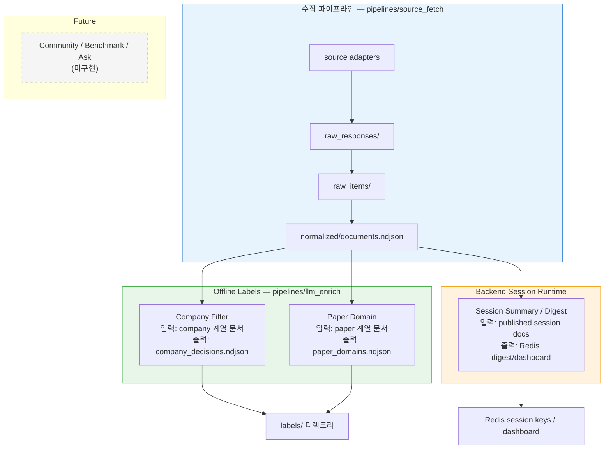
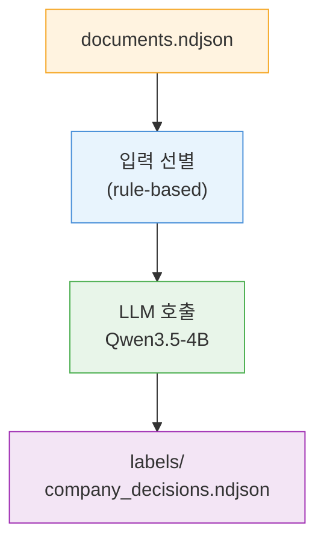
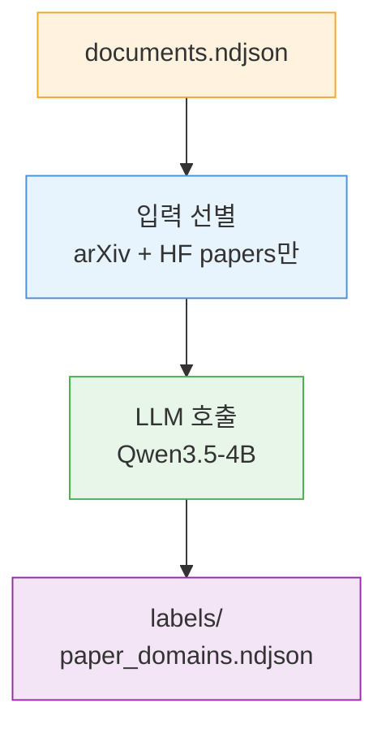

[Index](./README.md) · [01. Overall Flow](./01_overall_flow.md) · [02. Sections](./02_sections/README.md) · [02.1 Sources](./02_sections/02_1_sources.md) · [02.2 Fields](./02_sections/02_2_fields.md) · [03. Runtime Flow](./03_runtime_flow_draft.md) · **04. LLM Usage** · [05. Data Collection Pipeline](./05_data_collection_pipeline.md) · [06. UI Design Guide](./06_ui_design_guide.md)

---

# SparkOrbit - LLM Usage

> 2026-03-25 v5
>
> **이 문서의 위치:**
> 수집 파이프라인(`05`)이 만든 `documents.ndjson` 위에 얹는 LLM 판정/분류 계층을 설명한다.
> 실제 setup / run / verification 절차는 [06. Operational Playbook](./06_operational_playbook.md) 을 본다.

---

## 0. 현재 구현 상태 요약

<!-- ────────────────────────────────────────────
     읽는 사람이 가장 먼저 봐야 하는 것:
     "지금 뭐가 돌아가고 있는가?"
     ──────────────────────────────────────────── -->

| 단계 | 상태 | 코드 | prompt pack |
|------|------|------|-------------|
| **Company filter + domain 분류** | 구현 완료, 실행 가능 | `pipelines/llm_enrich/scripts/llm_enrich.py` | [company_filter_v2](./prompt_packs/company_filter_v2.md) |
| **Paper domain 분류** | 구현 완료, 실행 가능 | `pipelines/llm_enrich/scripts/paper_enrich.py` | [paper_domain_v1](./prompt_packs/paper_domain_v1.md) |
| **Session summary / digest** | 구현 완료, 런타임 사용 중 | `backend/app/services/session_service.py`, `backend/app/services/summary_provider.py` | backend runtime rule/provider |
| Community panel LLM | 별도 모델 경로는 미구현 | — | — |
| Benchmark panel LLM | 별도 모델 경로는 미구현 | — | — |
| Ask / QA | 미구현 | — | — |

추가 메모:

- `pipelines/llm_enrich`는 run output를 대상으로 한 오프라인 LLM labeling tooling이다.
- homepage summary lane은 `backend/app` session runtime이 만든 digest를 사용한다.
- summary provider 기본값은 `noop`이고, `heuristic` provider를 선택할 수 있다.

---

## 1. 설계 원칙

<!-- ────────────────────────────────────────────
     LLM을 "어디까지" 쓸 것인가의 가이드라인.
     규칙 기반으로 충분한 것은 LLM에 넘기지 않는다.
     ──────────────────────────────────────────── -->

1. LLM은 **규칙 기반으로 해결하기 어려운 좁은 작업**에만 쓴다
2. LLM 출력은 **JSON/NDJSON로 저장되는 구조화 결과**만 만든다
3. 프론트엔드는 `document_id`로 원본 document를 다시 조회해 메타데이터를 직접 렌더링한다
4. 날짜, URL, engagement, count, ordering은 **LLM이 다시 만들지 않는다**
5. panel별 instruction pack은 Markdown으로 version 관리한다 → `docs/prompt_packs/*.md`

---

## 2. 데이터 흐름 전체 그림

<!-- ────────────────────────────────────────────
     수집부터 LLM 판정/분류 출력까지의 전체 파이프라인.
     "어떤 데이터가 들어가서 어떤 데이터가 나오는가"를
     한눈에 보기 위한 그림.
     ──────────────────────────────────────────── -->



**최종 산출물:**

| 파일 | 내용 |
|------|------|
| `labels/company_decisions.ndjson` | company panel keep/drop + domain |
| `labels/paper_domains.ndjson` | paper panel domain 분류 |
| `labels/review_queue.ndjson` | needs_review 항목 모음 |
| `labels/llm_runs.ndjson` | 실행 로그 (모델, 시간, 통계) |
| `sparkorbit:session:{sid}:digest:{category}` | backend session runtime이 만든 category digest |

---

## 3. Company Filter — 상세

<!-- ────────────────────────────────────────────
     가장 먼저 구현한 LLM 판정 단계.
     Company 계열 source는 noise가 많아서
     LLM으로 keep/drop을 판정한다.
     ──────────────────────────────────────────── -->

### 3-1. 왜 Company부터 시작했나

Company 계열 source는 noise가 많다.

**drop 대상 (LLM이 걸러내는 것):**
- 행사 후기, 컨퍼런스 리캡
- 교육/세미나/아카데미 안내
- 채용/브랜딩/문화 소개 글
- 일반 홍보성 포스트

**keep 대상 (panel에 올라가야 하는 것):**
- 모델 공개/업데이트
- API / SDK / 제품 변경
- 기술 블로그 / 연구 성과
- 공개 OSS
- benchmark / eval 결과
- policy / safety 관련 발표

이 작업은 입력이 짧고, 출력 enum이 좁고, frontend가 바로 체감할 수 있어서 4B 실험의 첫 대상으로 적합하다.

### 3-2. 입력 → LLM → 출력



**Step 1 — 입력 선별** (rule-based, LLM 호출 전)

| 조건 | 내용 |
|------|------|
| 포함 | `source_category` ∈ {company, company_kr, company_cn} 또는 `source == hf_blog` |
| 포함 | `published_at` 또는 `sort_at` 기준 최근 90일 |
| 제외 | `github_*` source |
| 제외 | `text_scope`가 empty / metric_summary / generated_panel |
| 샘플링 | source별 최근 N개만 선택 (default: 5), sort_at DESC 정렬 |

**Step 2 — LLM에 넘기는 필드** (각 item에서 이것만 뽑는다)

```json
{
  "id":    "openai_news_rss:gpt5-turbo",
  "src":   "openai_news_rss",
  "title": "Introducing GPT-5.1 mini",
  "desc":  "We are releasing GPT-5.1 mini, a smaller..."
}
```

> `desc`는 description 앞 200자 (있을 때만). URL, 날짜, engagement 같은 메타데이터는 넘기지 않는다. 프론트가 `document_id`로 원본에서 직접 읽는다.

**Step 3 — LLM 출력** (각 item마다 정확히 하나)

```json
{
  "document_id":    "openai_news_rss:gpt5-turbo",
  "decision":       "keep",
  "company_domain": "model_release",
  "reason_code":    "model_signal"
}
```

> pipeline이 자동으로 `filter_scope`, `model_name`, `runtime`, `prompt_version`, `schema_version`, `generated_at`을 추가한다.

### 3-3. Enum 정의

<!-- ────────────────────────────────────────────
     LLM이 반환할 수 있는 값의 전체 목록.
     이 enum은 guided_json schema로 강제된다.
     ──────────────────────────────────────────── -->

**`decision`** — 이 문서를 company panel에 올릴 것인가

| 값 | 의미 |
|----|------|
| `keep` | panel 가치가 명확 → 화면에 올린다 |
| `drop` | 홍보/행사/채용 등 → 화면에서 뺀다 |
| `needs_review` | 판단 불확실 → 수동 확인 대상 |

**`company_domain`** — keep일 때, 어떤 종류의 발표인가

| 값 | 의미 | 예시 |
|----|------|------|
| `model_release` | 신규/업데이트 모델 발표 | "Introducing GPT-5.1 mini" |
| `product_update` | API, SDK, 플랫폼, 가격 변경 | "New region available", "SDK v3" |
| `technical_research` | 기술 블로그, 연구 결과, 방법론 | "보안 모니터링 아키텍처 설계" |
| `open_source` | OSS 릴리즈, 프레임워크/라이브러리 공개 | "Open-sourcing our agent framework" |
| `benchmark_eval` | 벤치마크 결과, 평가 방법론 | "Our model scores 92.3 on..." |
| `partnership_ecosystem` | 파트너십, 인수, 제휴 | "Partnership with X for Y" |
| `policy_safety` | AI 안전, 거버넌스, 규제 대응 | "Responsible AI report 2026" |
| `others` | 위에 해당 없지만 keep할 가치 있음 | — |
| `null` | drop일 때 | — |

**`reason_code`** — 판단 근거 코드

| 값 | 용도 |
|----|------|
| `model_signal` | 모델 관련 keep |
| `product_signal` | 제품 관련 keep |
| `research_signal` | 연구 관련 keep |
| `oss_signal` | OSS 관련 keep |
| `benchmark_signal` | 벤치마크 관련 keep |
| `partnership_signal` | 파트너십 관련 keep |
| `policy_signal` | 정책/안전 관련 keep |
| `other_signal` | 기타 keep |
| `event_or_program` | 행사/프로그램 → drop |
| `recruiting_or_pr` | 채용/PR → drop |
| `general_promo` | 일반 홍보 → drop |
| `unclear_scope` | 범위 불명확 → needs_review |
| `runtime_fallback` | LLM 실패 시 시스템이 자동 부여 |

### 3-4. 이 결과를 쓰면 가능한 것

Company filter가 완료되면 아래가 가능해진다:

1. **Company panel 노이즈 제거** — `decision=keep`인 문서만 화면에 올릴 수 있다
2. **Domain별 그룹핑** — `company_domain`으로 "모델 발표", "제품 업데이트", "연구" 등을 나눠 볼 수 있다
3. **Reason 기반 필터** — `reason_code`로 왜 keep/drop 했는지 추적할 수 있다
4. **Quality 모니터링** — `needs_review` 비율과 `runtime_fallback` 비율로 모델 품질을 추적한다

---

## 4. Paper Domain — 상세

<!-- ────────────────────────────────────────────
     두 번째로 구현한 LLM 분류 단계.
     논문을 연구 분야별로 분류한다.
     ──────────────────────────────────────────── -->

### 4-1. 왜 Paper domain 분류가 필요한가

arXiv만 해도 8개 카테고리(cs.AI, cs.LG, cs.CL, cs.CV, cs.RO, cs.IR, cs.CR, stat.ML)에서 수집하고, HF daily papers도 합치면 한 번에 수백 편이 들어온다. arXiv 카테고리는 넓어서("cs.AI"에 agent도, safety도, evaluation도 다 섞여 있다), 사용자가 관심 분야를 빠르게 찾으려면 더 세밀한 분류가 필요하다.

### 4-2. 입력 → LLM → 출력



**Step 1 — 입력 선별** (rule-based)

| 조건 | 내용 |
|------|------|
| 포함 source | `arxiv_rss_cs_ai`, `cs_lg`, `cs_cl`, `cs_cv`, `cs_ro`, `cs_ir`, `cs_cr`, `stat_ml`, `hf_daily_papers` |
| 정렬 | sort_at DESC |
| recency 필터 | 없음 (RSS 피드 자체가 최신) |

**Step 2 — LLM에 넘기는 필드** (title만 — 매우 경량)

```json
{
  "id":    "arxiv_rss_cs_ai:2603.19429",
  "title": "AgentSwarm: Cooperative Multi-Agent Planning with Tool Use"
}
```

> abstract(description)는 넘기지 않는다. title만으로 분류하므로 chunk 크기를 크게 잡을 수 있다 (default chunk_size: 100).

**Step 3 — LLM 출력** (각 논문마다 정확히 하나)

```json
{
  "document_id": "arxiv_rss_cs_ai:2603.19429",
  "paper_domain": "agents"
}
```

> pipeline이 자동으로 `filter_scope("paper_panel")`, `model_name`, `runtime`, `prompt_version`, `schema_version`, `generated_at`을 추가한다.

### 4-3. Paper Domain Enum (22개)

<!-- ────────────────────────────────────────────
     arXiv 카테고리보다 세밀한 연구 분야 분류.
     사용자가 "LLM 관련 논문만", "agent 관련만"
     처럼 필터하기 위한 것.
     ──────────────────────────────────────────── -->

| domain | 의미 | 키워드 예시 |
|--------|------|------------|
| `llm` | 대규모 언어 모델 아키텍처, 사전학습, 스케일링 | GPT, LLaMA, pretraining |
| `vlm` | 비전-언어 모델, 멀티모달 이해 | CLIP, LLaVA, image-text |
| `diffusion` | 확산 모델, 이미지/비디오 생성 | Stable Diffusion, text-to-image |
| `agents` | AI 에이전트, 도구 사용, 계획 | tool use, web agent, planning |
| `reasoning` | 추론, 수학, 코드 생성, chain-of-thought | CoT, math reasoning |
| `rlhf_alignment` | RLHF, DPO, 정렬, 선호 학습 | preference, alignment |
| `safety` | AI 안전, 탈옥, 독성, guardrail | jailbreak, red-teaming |
| `rag_retrieval` | 검색증강생성, 임베딩, 리랭킹 | RAG, dense retrieval |
| `efficient_inference` | 양자화, 증류, 프루닝, 서빙 최적화 | quantization, KV cache |
| `finetuning` | LoRA, 어댑터, PEFT, instruction tuning | adapter, PEFT |
| `evaluation` | 벤치마크, 평가 방법론 | benchmark, leaderboard |
| `nlp` | 전통 NLP, 번역, 요약, NER | summarization, NER |
| `speech_audio` | 음성, 오디오, TTS, ASR | TTS, voice, ASR |
| `robotics_embodied` | 로봇, embodied AI | manipulation, navigation |
| `video` | 비디오 이해/생성, temporal modeling | video generation |
| `3d_spatial` | 3D 비전, NeRF, gaussian splatting | point cloud, NeRF |
| `graph_structured` | 그래프 신경망, knowledge graph | GNN, molecular |
| `continual_learning` | 지속 학습, catastrophic forgetting | incremental learning |
| `federated_privacy` | 연합학습, 차등 프라이버시 | federated, DP |
| `medical_bio` | 의료 AI, 바이오, 단백질 | drug discovery, biomedical |
| `science` | 과학 AI, 기후, 물리, 수학, 재료 | climate, physics |
| `others` | 위에 해당 없음 | — |

**domain 우선순위 규칙:**
- `LLM + agent` → `agents` (응용이 우선)
- `LLM + reasoning` → `reasoning` (능력이 우선)
- `VLM + video` → `video` (modality가 우선)
- `diffusion + 3D` → `3d_spatial` (출력 modality가 우선)

### 4-4. 이 결과를 쓰면 가능한 것

Paper domain 분류가 완료되면 아래가 가능해진다:

1. **연구 분야별 필터** — "agent 논문만 보기", "safety 논문만 보기" 가능
2. **분야별 트렌드** — 오늘 어떤 분야의 논문이 많이 올라왔는지 분포 확인
3. **arXiv 카테고리 보완** — cs.AI에 섞여 있던 agent/safety/eval 논문을 분리
4. **관심 분야 알림** — 사용자가 관심 domain을 설정하면 해당 논문만 하이라이트

---

## 5. 모델 & 런타임

<!-- ────────────────────────────────────────────
     현재 쓰고 있는 모델과 서빙 설정.
     ──────────────────────────────────────────── -->

### 5-1. 4B-first 전략

현재는 `Qwen/Qwen3.5-4B`를 **경량/실험용 기본 모델**로 쓴다.

목적:
1. 가장 좁고 구조화된 enrichment가 4B에서 안정적으로 돌아가는지 본다
2. prompt, schema, retry 전략을 먼저 고정한다
3. 품질이 부족한 단계만 나중에 9B 이상으로 올린다

### 5-2. 런타임 설정

| 항목 | 값 | 비고 |
|------|-----|------|
| runtime | Ollama | Docker 기반, 로컬 GPU |
| model | `qwen3.5:4b` | Ollama tag 기준 |
| mode | text-only | vision encoder 제외 |
| thinking | off | `think: false` |
| API | `http://localhost:11434/api/chat` | — |

### 5-3. 샘플링 파라미터

HF 공식 non-thinking 일반 작업 권장값을 초기값으로 쓴다.

| 파라미터 | 값 | 출처 |
|----------|-----|------|
| `temperature` | `0.7` | HF model card |
| `top_p` | `0.8` | HF model card |
| `top_k` | `20` | HF model card |
| `min_p` | `0.0` | HF model card |
| `repeat_penalty` | `1.0` | HF의 `repetition_penalty` 대응 |
| `num_ctx` | `8192` | Ollama default |

> `presence_penalty=1.5` (HF 권장)는 Ollama native chat options에 1:1 대응이 없어 reference로만 남긴다.

### 5-4. Token budget 측정값 (Company filter 기준)

`company_filter_v2` prompt pack과 실제 company candidate 문서로 측정한 입력 토큰:

| docs 수 | prompt_eval_count |
|---------|-------------------|
| 1 | 585 |
| 2 | 886 |
| 4 | 1,466 |
| 8 | 2,624 |
| 12 | 3,695 |

근사식: **`input_tokens ≈ 321 + 283 × doc_count`**

`num_ctx=8192`에서 output reserve 1,200~2,000을 남기면 이론상 20~23 docs까지 가능하지만, `reason` 자유 문자열 때문에 output이 예상보다 커질 수 있다.

| 설정 | doc 수 | 상태 |
|------|--------|------|
| 기본 batch | 8~12 | 안전 |
| 품질 검증 후 확장 | 16 | 후보 |
| 비권장 | 20+ | output 초과 위험 |

> Paper domain 분류는 title만 넘기므로 item당 토큰이 훨씬 적다.
> 현재 default chunk_size는 `100`으로, 대부분의 run에서 한 번에 처리 가능하다.

---

## 6. 공통 기술 설계

<!-- ────────────────────────────────────────────
     Company filter와 Paper domain 모두에 공통으로 적용되는 설계 원칙.
     ──────────────────────────────────────────── -->

### 6-1. 강한 JSON schema (guided_json)

`4B`는 자유 서술보다 **고정된 구조 출력**에서 더 안정적이다.

- Ollama의 `format` 파라미터에 JSON schema를 직접 전달한다
- enum 값은 코드에 상수로 고정하고, schema에서 강제한다
- 출력은 JSON array만 허용, 설명 문장이나 markdown은 금지

### 6-2. instruction-first, few-shot-later

현재 모든 pack은 `instruction-first`로 간다.

- 강한 instruction과 좁은 schema를 먼저 고정한다
- few-shot 예시는 prompt pack 문서에 남기되 runtime 기본값으로는 넣지 않는다
- domain confusion이 반복될 때만 few-shot을 추가한다

### 6-3. chunked batch

긴 prompt 하나보다 작은 chunk 여러 개가 더 안전하다.

- Company filter: default chunk_size `30`
- Paper domain: default chunk_size `100` (title-only라 작음)
- 초기 실험에서는 보수적으로 시작

### 6-4. validate → retry → bisect

작은 모델일수록 schema 이탈이 더 쉽게 난다. 실패 처리가 설계에 포함되어 있다.

1. **schema validate** — JSON 파싱 + enum 값 + document_id 검증
2. **bisect retry** — 실패 시 chunk를 반으로 나눠 재시도 (recursive)
3. **단일 item fallback** — 1개까지 내려가도 실패하면:
   - Company → `decision=needs_review`, `reason_code=runtime_fallback`
   - Paper → `paper_domain=others`, `failure_reason=fallback`

### 6-5. Prompt pack → 코드 연결

runtime script는 prompt를 코드 상수로 두지 않고, Markdown prompt pack 파일에서 직접 읽는다.

| prompt pack 파일 내 블록 | 용도 |
|------------------------|------|
| `` ```prompt-system``` `` | system message로 사용 |
| `` ```prompt-user-template``` `` | user message 템플릿으로 사용 (`{documents_json}` 자리에 실제 데이터 삽입) |

prompt 변경 = Markdown 파일 수정만으로 반영.

### 6-6. prefix caching

같은 system prompt, 같은 schema, 같은 few-shot 예시를 반복해서 쓰므로 prefix caching 이득이 크다.
반복 batch 작업에서는 켜는 편이 맞다.

---

## 7. 검증 기준

<!-- ────────────────────────────────────────────
     "잘 되고 있는가"를 어떻게 판단하는가.
     ──────────────────────────────────────────── -->

### Company filter

| 지표 | 무엇을 보나 |
|------|------------|
| JSON schema 준수율 | `runtime_fallback` 비율이 낮아야 함 |
| keep/drop precision | 사람이 보기에 맞는 판정인가 |
| company_domain 일관성 | 같은 유형의 글에 같은 domain을 붙이는가 |

### Paper domain

| 지표 | 무엇을 보나 |
|------|------------|
| JSON schema 준수율 | `fallback_items` 비율이 낮아야 함 |
| domain 분포 | `others`에 몰리지 않고 적절히 분산되는가 |
| domain 정확도 | title 기준으로 사람이 보기에 맞는 분류인가 |

지금은 "얼마나 똑똑한 요약을 하느냐"보다, **안정적으로 저장 가능한 구조 결과를 만들 수 있느냐**가 더 중요하다.

---

## 8. Enrichment 전후 비교 — 무엇이 달라지는가

<!-- ────────────────────────────────────────────
     enrichment를 거치면 데이터에 어떤 개념이 추가되는지.
     프론트엔드나 다음 파이프라인 단계에서
     무엇을 새로 할 수 있게 되는지.
     ──────────────────────────────────────────── -->

### Before (수집만 완료)

`documents.ndjson`의 각 문서가 이미 갖고 있는 것:

| 있는 것 | 필드 | 용도 |
|---------|------|------|
| 원문 텍스트 | `title`, `description`, `body_text` | 카드 표시, 검색 |
| 출처 분류 | `source`, `source_category`, `doc_type` | 패널 배치 |
| 인기도 수치 | `engagement`, `engagement_primary` | 정렬, 핫한 정도 |
| 새로움/트렌딩 | `discovery` (spark_score 등) | 신규 아이템 하이라이트 |
| 화면 정렬 점수 | `ranking` (feed_score 등) | 상단/하단 배치 |
| 키워드 | `tags` | 필터, 클러스터링 |
| 원문 링크 | `reference_url` | 드릴다운 |

이 시점에서 **할 수 없는 것:**
- "이 company 글이 panel에 올릴 가치가 있는가?" → 판단 불가
- "이 논문이 어떤 연구 분야인가?" → arXiv 카테고리만 (너무 넓음)
- "채용 글과 기술 블로그를 어떻게 구분하나?" → 규칙으로 불가능

### After (LLM 라벨 완료)

| 추가된 것 | 파일 | 필드 | 용도 |
|-----------|------|------|------|
| panel 노출 여부 | `company_decisions.ndjson` | `decision` | keep/drop/needs_review |
| 발표 유형 | `company_decisions.ndjson` | `company_domain` | model_release, product_update 등 |
| 판단 근거 | `company_decisions.ndjson` | `reason_code` | model_signal, recruiting_or_pr 등 |
| 연구 분야 | `paper_domains.ndjson` | `paper_domain` | agents, llm, safety 등 |

**프론트엔드가 활용 가능한 새로운 축:**

1. Company panel 필터링 — `drop` 제거로 노이즈 없는 피드
2. Company domain별 탭/그룹 — "모델 발표"만, "연구"만 보기
3. Paper domain별 탭/그룹 — "agent 논문만", "safety만" 보기
4. 분야별 논문 수 분포 차트
5. needs_review 큐 — 수동 검토 대상 관리

---

## 9. 다음 단계

<!-- ────────────────────────────────────────────
     현재 구현된 두 단계 이후의 확장 방향.
     아직 구현되지 않았으므로 간략하게만 남긴다.
     ──────────────────────────────────────────── -->

현재 두 단계(Company filter, Paper domain)가 안정적으로 통과하면 다음으로 넓힌다.

1. 품질이 부족한 단계만 `Qwen3.5-9B`로 승격
2. Summary digest 소규모 시험
3. Community panel LLM 라벨 검토

확장 순서는 `all-in`이 아니라 **단계별 승격**이다.

---

## 10. 참고 링크

- [Qwen3.5-4B](https://huggingface.co/Qwen/Qwen3.5-4B)
- [Ollama Structured Outputs](https://docs.ollama.com/capabilities/structured-outputs)
