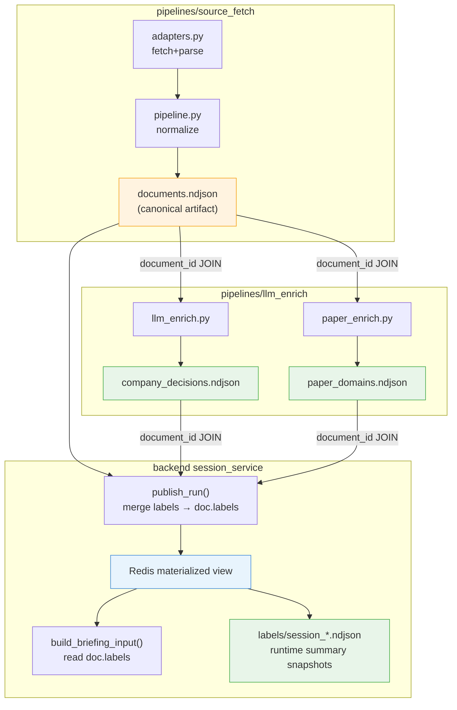

[Index](./README.md) · [01. Overall Flow](./01_overall_flow.md) · [02. Sections](./02_sections/README.md) · [02.1 Sources](./02_sections/02_1_sources.md) · [02.2 Fields](./02_sections/02_2_fields.md) · [03. Runtime Flow](./03_runtime_flow_draft.md) · [04. LLM Usage](./04_llm_usage.md) · [05. Data Collection Pipeline](./05_data_collection_pipeline.md) · [06. UI Design Guide](./06_ui_design_guide.md) · **08. Data Schema & Links**

---

# SparkOrbit - 08. Data Schema & Links

> 2026-03-25 v2
>
> 수집 → LLM 라벨 → 세션 머지 → 브리핑까지 이어지는 데이터 스키마, 조인 키, 링크 관계를 정의한다.
> 새로운 파이프라인 단계나 프론트엔드 기능을 추가할 때 이 문서의 스키마와 관계를 따른다.

### Monitor Sync Rule

dashboard/monitor에 보이는 계약은 backend materialized payload와 frontend renderer가 함께 유지해야 한다.

규칙:

1. monitor-visible payload field를 추가/삭제/이름 변경하면 backend 응답 생성 코드와 frontend 소비 코드를 같은 수정에서 함께 바꾼다.
2. `session`, `summary`, `feeds`, `document detail`, `digest detail`에 영향을 주는 변경은 TS 타입, content mapping, render fallback까지 같이 점검한다.
3. backend에서 더 이상 보내지지 않는 필드를 frontend가 계속 읽거나, frontend가 기대하는 필드를 backend가 빠뜨리는 상태를 허용하지 않는다.

---

## 0. 전체 데이터 흐름과 조인 키



**모든 링크는 `document_id` 하나로 연결된다.** 별도의 외래 키, 시퀀스, 자동 증가 ID는 없다.

---

## 1. Primary Key: document_id

### 생성 규칙

```
document_id = "{source}:{source_item_id}"
```

| 요소 | 출처 | 예시 |
|------|------|------|
| `source` | `SourceConfig.name` (adapter 등록 시 고정) | `arxiv_rss_cs_ai`, `openai_news_rss`, `hf_trending_models` |
| `source_item_id` | adapter가 추출한 원본 ID (URL, arXiv ID, model ID 등) | `oai:arXiv.org:2603.22306v1`, `https://openai.com/blog/...` |

**생성 위치:** `pipeline.py:normalize_document_contract()` — source와 source_item_id가 있으면 자동 생성.

### 불변 규칙

1. 한 번 생성된 `document_id`는 run 전체에서 변하지 않는다
2. 같은 source + source_item_id 조합은 항상 같은 document_id를 만든다
3. LLM 라벨 파일의 `document_id`는 반드시 `documents.ndjson`에 존재하는 값이어야 한다
4. LLM 스크립트의 validate 함수가 1:1 매핑을 강제한다 — 누락이나 중복 시 ValueError

---

## 2. Artifact 1: documents.ndjson (Normalized Document)

> 경로: `pipelines/source_fetch/data/runs/<run_id>/normalized/documents.ndjson`

### 전체 필드 목록

아래 표의 **그룹**은 코드 내 논리적 분류이며, NDJSON 파일에서는 flat한 top-level 키로 나열된다.

#### Identity & Origin

| 필드 | 타입 | Nullable | 설명 | 사용처 |
|------|------|----------|------|--------|
| `document_id` | `string` | No | **Primary Key**. `{source}:{source_item_id}` | 모든 조인, Redis key, feed list |
| `run_id` | `string` | No | 수집 run 식별자. `2026-03-25T150713Z_data-test` | run 추적 |
| `source` | `string` | No | adapter 이름. 패널 배치 기준 | labels 소스 선별, feed 그룹핑 |
| `source_category` | `string` | No | 패널 매핑. `papers`, `models`, `community`, `company`, `company_kr`, `company_cn`, `benchmark` | digest 그룹핑, briefing 카테고리 |
| `source_method` | `string` | No | 수집 방법. `rss`, `json_api`, `html_list` | 디버깅 |
| `source_endpoint` | `string` | No | 수집 URL | 디버깅, raw_ref 추적 |
| `source_item_id` | `string` | No | 원본 시스템의 고유 ID | document_id 생성, 외부 링크 |
| `doc_type` | `string` | No | 문서 유형. `paper`, `blog`, `news`, `model`, `model_trending`, `repo`, `benchmark`, `benchmark_panel` 등 | UI 배지, feed_meta, 정렬 |
| `content_type` | `string` | Yes | `doc_type`과 동일하거나 세부 분류 | 예비 |
| `text_scope` | `string` | Yes | 텍스트 범위. `title_only`, `title+description`, `full_text`, `empty`, `metric_summary`, `generated_panel` | LLM 입력 선별 기준 |

#### Content

| 필드 | 타입 | Nullable | 설명 | 사용처 |
|------|------|----------|------|--------|
| `title` | `string` | No* | 문서 제목 | 화면 표시, LLM 입력, displayable 판정 |
| `description` | `string` | Yes | 요약/설명 | 카드 note, company filter desc 입력 |
| `url` | `string` | Yes | 원본 URL | displayable 판정 (3개 중 하나 필요) |
| `canonical_url` | `string` | Yes | 정규 URL | displayable 판정 |
| `reference_url` | `string` | Yes | 표시용 링크 (우선) | FE referenceUrl, displayable 판정 |
| `author` | `string` | Yes | 대표 저자 | 배지, feed_meta |
| `authors` | `string[]` | No | 저자 목록 | — |
| `body_text` | `string` | Yes | 본문 전체 텍스트 | company filter desc fallback |
| `summary_input_text` | `string` | Yes | title+description+body 결합 텍스트 | summary candidate 선별 |
| `language` | `string` | Yes | 언어 코드 | 예비 |
| `content_format` | `string` | Yes | `plain_text`, `html` | 예비 |

> *`title`이 없으면 `has_displayable_reference()`가 `false`를 반환해 화면에서 제외됨.

#### Timestamps

| 필드 | 타입 | Nullable | 설명 | 사용처 |
|------|------|----------|------|--------|
| `published_at` | `string (ISO 8601)` | Yes | 원본 게시일 | 정렬, 날짜 필터, company 90일 기준 |
| `updated_at` | `string (ISO 8601)` | Yes | 원본 수정일 | sort_at fallback |
| `sort_at` | `string (ISO 8601)` | Yes | 정렬용 타임스탬프 (fallback chain: updated_at → published_at → fetched_at) | 1차 정렬 기준, briefing cutoff |
| `time_semantics` | `string` | Yes | `published`, `updated`, `observed` | — |
| `timestamp_kind` | `string` | Yes | `time_semantics` alias | — |
| `fetched_at` | `string (ISO 8601)` | No | 수집 시각 | sort_at 최종 fallback |

#### External References

| 필드 | 타입 | Nullable | 설명 | 사용처 |
|------|------|----------|------|--------|
| `external_ids` | `object` | No (default `{}`) | 외부 ID 매핑. `{"arxiv": "2603.19429"}`, `{"feed_entry_id": "..."}` | 외부 시스템 연동 |
| `related_urls` | `string[]` | No (default `[]`) | 관련 링크 | — |
| `tags` | `string[]` | No (default `[]`) | 태그 목록. 보통 `[source_category, source, doc_type, ...]` | 필터, digest key_points |

#### Engagement

| 필드 | 타입 | Nullable | 설명 | 사용처 |
|------|------|----------|------|--------|
| `engagement` | `object` | No (default `{}`) | source별 engagement 수치. `{likes, downloads, stars, score, ...}` | feed_meta 표시, spark_score 계산 |
| `engagement_primary` | `object` | No | `{name: string|null, value: number|null}` — 대표 engagement 지표 | briefing models likes 계산 |

#### Computed Profiles

| 필드 | 타입 | Nullable | 설명 | 사용처 |
|------|------|----------|------|--------|
| `discovery` | `object` | No | 신규/트렌딩 프로파일 | briefing freshness, spark_score |
| `discovery.is_new` | `boolean` | — | ≤12h | — |
| `discovery.age_hours` | `float` | — | 수집 시점 기준 경과 시간 | — |
| `discovery.freshness_bucket` | `string` | — | `just_now` \| `new` \| `recent` \| `active` \| `established` | briefing models freshness |
| `discovery.spark_score` | `int (0-100)` | — | 종합 점수 | importance_score fallback |
| `discovery.spark_bucket` | `string` | — | `sparkling` \| `rising` \| `new` \| `steady` | feed_meta |
| `discovery.primary_reason` | `string` | — | 주된 이유 | importance_reason |
| `ranking` | `object` | No | 화면 정렬 프로파일 | document_sort_key, briefing |
| `ranking.feed_score` | `int (0-100)` | — | 최종 정렬 점수 | **1차 정렬 키** |
| `ranking.feed_bucket` | `string` | — | `top` \| `live` \| `recent` \| `archive` | — |
| `ranking.age_penalty` | `int` | — | 시간 경과 감점 | — |
| `ranking.evergreen_bonus` | `int` | — | 오래됐지만 인기 높은 보너스 | — |
| `ranking.priority_reason` | `string` | — | 주된 이유 | feed_meta, signal_reason |

#### Benchmark (benchmark 패널 전용)

| 필드 | 타입 | Nullable | 설명 |
|------|------|----------|------|
| `benchmark` | `object` | No (default all null) | 리더보드 정보 |
| `benchmark.board_id` | `string` | Yes | 보드 식별자 |
| `benchmark.board_name` | `string` | Yes | 보드 이름 (`LMArena Overall`, `LMArena Vision` 등) |
| `benchmark.rank` | `int` | Yes | 순위 |
| `benchmark.score_label` | `string` | Yes | 점수 레이블 |
| `benchmark.score_value` | `float` | Yes | 점수 |
| `benchmark.score_unit` | `string` | Yes | 단위 (`%`, `elo` 등) |
| `benchmark.model_name` | `string` | Yes | 모델명 |
| `benchmark.organization` | `string` | Yes | 조직명 |
| `benchmark.total_models` | `int` | Yes | 전체 모델 수 |
| `benchmark.total_votes` | `int` | Yes | 전체 투표 수 |
| `benchmark.snapshot_at` | `string` | Yes | 스냅샷 시각 |
| `benchmark.votes` | `int` | Yes | 개별 투표 수 |

#### Reference (FE 표시용)

| 필드 | 타입 | Nullable | 설명 |
|------|------|----------|------|
| `reference` | `object` | No | 화면 표시용 축약 정보 |
| `reference.source_label` | `string` | — | source 표시명 |
| `reference.display_title` | `string` | — | 표시용 제목 |
| `reference.display_url` | `string` | — | 표시용 URL |
| `reference.snippet` | `string` | — | 요약 snippet |

#### LLM Placeholder

| 필드 | 타입 | Nullable | 설명 |
|------|------|----------|------|
| `llm` | `object` | No | 수집 시 placeholder. session publish 시 `ensure_llm_status()`가 채움 |
| `llm.status` | `string` | — | `pending` \| `not_selected` \| `complete` \| `error` |
| `llm.summary_1l` | `string` | Yes | 1줄 요약 (heuristic 또는 LLM) |
| `llm.summary_short` | `string` | Yes | 짧은 요약 |
| `llm.key_points` | `string[]` | — | 핵심 포인트 |
| `llm.entities` | `string[]` | — | 추출 엔티티 |
| `llm.primary_domain` | `string` | Yes | source_category 기반 |
| `llm.importance_score` | `int` | Yes | feed_score 또는 spark_score |
| `llm.importance_reason` | `string` | Yes | priority_reason |

#### Metadata & Raw Reference

| 필드 | 타입 | Nullable | 설명 |
|------|------|----------|------|
| `metadata` | `object` | No (default `{}`) | source별 추가 정보. model: `{pipeline_tag, ...}`, repo: `{full_name, language, ...}`, lmarena: `{top_entries, ...}` |
| `raw_ref` | `object` | No | 원본 추적 정보 `{fetch_id, line_index, response_file}` |

---

## 3. Artifact 2: company_decisions.ndjson

> 경로: `<run_dir>/labels/company_decisions.ndjson`
> 생성: `pipelines/llm_enrich/scripts/llm_enrich.py`
> 조인 키: `document_id` → `documents.ndjson`

### 스키마

| 필드 | 타입 | Nullable | 설명 |
|------|------|----------|------|
| `document_id` | `string` | No | **FK → documents.ndjson** |
| `filter_scope` | `string` | No | 항상 `"company_panel"` |
| `decision` | `string` | No | `keep` \| `drop` \| `needs_review` |
| `company_domain` | `string` | Yes | keep 시 도메인 분류. drop이면 `null` |
| `reason_code` | `string` | No | 판단 근거 코드 |
| `model_name` | `string` | No | 사용 모델. `"qwen3.5:4b"` |
| `runtime` | `string` | No | `"ollama"` |
| `prompt_version` | `string` | No | `"company_filter_v2"` |
| `schema_version` | `string` | No | `"document_filter_v2"` |
| `generated_at` | `string (ISO 8601)` | No | 생성 시각 |
| `failure_reason` | `string` | Yes | fallback 시에만 존재 |

### 입력 선별 규칙

```
source_category ∈ {company, company_kr, company_cn} OR source == "hf_blog"
AND NOT source.startswith("github_")
AND text_scope NOT IN {empty, metric_summary, generated_panel}
AND (published_at OR sort_at) >= now - 90 days
→ source별 최근 5개만, sort_at DESC
```

### LLM 입력 형식

```json
{"id": "<document_id>", "src": "<source>", "title": "...", "desc": "앞 200자 (있을 때만)"}
```

> `id` → LLM이 `document_id`로 반환. prompt가 이 변환을 지시.

---

## 4. Artifact 3: paper_domains.ndjson

> 경로: `<run_dir>/labels/paper_domains.ndjson`
> 생성: `pipelines/llm_enrich/scripts/paper_enrich.py`
> 조인 키: `document_id` → `documents.ndjson`

### 스키마

| 필드 | 타입 | Nullable | 설명 |
|------|------|----------|------|
| `document_id` | `string` | No | **FK → documents.ndjson** |
| `filter_scope` | `string` | No | 항상 `"paper_panel"` |
| `paper_domain` | `string` | No | 22개 도메인 중 하나 |
| `model_name` | `string` | No | `"qwen3.5:4b"` |
| `runtime` | `string` | No | `"ollama"` |
| `prompt_version` | `string` | No | `"paper_domain_v1"` |
| `schema_version` | `string` | No | `"paper_domain_v1"` |
| `generated_at` | `string (ISO 8601)` | No | 생성 시각 |
| `failure_reason` | `string` | Yes | fallback 시에만 존재 |

### 입력 선별 규칙

```
source ∈ {arxiv_rss_cs_ai, arxiv_rss_cs_lg, arxiv_rss_cs_cl, arxiv_rss_cs_cv,
          arxiv_rss_cs_ro, arxiv_rss_cs_ir, arxiv_rss_cs_cr, arxiv_rss_stat_ml,
          hf_daily_papers}
→ 전체 선택, sort_at DESC
```

### LLM 입력 형식

```json
{"id": "<document_id>", "title": "..."}
```

> title만. description/body_text 없음. chunk_size 100 가능.

---

## 5. Artifact 4: llm_runs.ndjson

> 경로: `<run_dir>/labels/llm_runs.ndjson`
> append-only. company_filter와 paper_domain 실행 로그가 순서대로 쌓임.

### 스키마

| 필드 | 타입 | 설명 |
|------|------|------|
| `phase` | `string` | `"company_filter"` \| `"paper_domain"` |
| `runtime` | `string` | `"ollama"` |
| `base_url` | `string` | Ollama 주소 |
| `model_name` | `string` | 모델명 |
| `prompt_version` | `string` | prompt pack 버전 |
| `schema_version` | `string` | 출력 스키마 버전 |
| `chunk_size` | `int` | batch 크기 |
| `started_at` | `string` | 시작 시각 |
| `finished_at` | `string` | 종료 시각 |
| `request_count` | `int` | LLM 호출 횟수 |
| `split_retries` | `int` | bisect 재시도 횟수 |
| `fallback_items` | `int` | 최종 fallback 건수 |
| `output_count` | `int` | 출력 건수 |
| `needs_review_count` | `int` | needs_review 건수 (company만) |

### Runtime Artifact: session_document_summaries.ndjson

> 경로: `<run_dir>/labels/session_document_summaries.ndjson`
> 생성: `backend/app/services/session_service.py:run_session_enrichment()`

ID 규칙:

```
summary_id = "{session_id}:document:{document_id}"
```

핵심 필드:

| 필드 | 설명 |
|------|------|
| `summary_id` | runtime summary PK |
| `artifact_type` | 항상 `"document_summary"` |
| `session_id` | Redis session ID |
| `run_id` | source_fetch run ID |
| `document_id` | **FK → documents.ndjson** |
| `status` | `pending` \| `not_selected` \| `complete` \| `error` |
| `summary_1l` | 1줄 요약 |
| `summary_short` | 짧은 요약 |
| `key_points` | 핵심 포인트 |
| `provider_name` | `noop` \| `heuristic` \| 기타 provider |
| `model_name` | 모델명 |
| `prompt_version` | prompt version |
| `generated_at` | 생성 시각 |

### Runtime Artifact: session_category_digests.ndjson

> 경로: `<run_dir>/labels/session_category_digests.ndjson`
> 생성: `backend/app/services/session_service.py:run_session_enrichment()`

ID 규칙:

```
digest_id = "{session_id}:digest:{category}"
```

핵심 필드:

| 필드 | 설명 |
|------|------|
| `digest_id` | runtime digest PK |
| `artifact_type` | 항상 `"category_digest"` |
| `session_id` | Redis session ID |
| `run_id` | source_fetch run ID |
| `category` | `papers`, `models`, `community`, ... |
| `headline` | digest headline |
| `summary` | digest summary |
| `evidence` | evidence line |
| `document_ids` | 관련 문서 ID 목록 |
| `updated_at` | digest 생성 시각 |

### Runtime Artifact: session_briefings.ndjson

> 경로: `<run_dir>/labels/session_briefings.ndjson`
> 생성: `backend/app/services/session_service.py:run_session_enrichment()`

ID 규칙:

```
briefing_id = "{session_id}:briefing:daily"
```

핵심 필드:

| 필드 | 설명 |
|------|------|
| `briefing_id` | runtime briefing PK |
| `artifact_type` | 항상 `"session_briefing"` |
| `session_id` | Redis session ID |
| `run_id` | source_fetch run ID |
| `body_en` | 최종 briefing 본문 |
| `category_summaries` | category별 intermediate summary |
| `error` | briefing 오류 |
| `model_name` | 모델명 |
| `prompt_version` | prompt version |
| `generated_at` | 생성 시각 |

---

## 6. Session Merge: Labels → Document

`session_service.py:publish_run()` 에서 documents.ndjson의 각 문서에 labels를 머지한다.

### 머지 로직

```python
# 1. Lookup 테이블 구성
company_lookup = {row["document_id"]: row for row in company_decisions}
paper_lookup   = {row["document_id"]: row["paper_domain"] for row in paper_domains}

# 2. 각 document에 labels 주입
for doc in documents:
    labels = {}
    if doc_id in company_lookup:
        labels["company"] = {
            "decision":       cd["decision"],
            "company_domain": cd["company_domain"],
            "reason_code":    cd["reason_code"],
        }
    if doc_id in paper_lookup:
        labels["paper_domain"] = paper_lookup[doc_id]  # string
    if labels:
        doc["labels"] = labels
```

### 머지 후 document에 추가되는 필드

| 필드 경로 | 타입 | 조건 | 설명 |
|-----------|------|------|------|
| `labels` | `object` | labels 파일이 존재하고 해당 doc_id가 있을 때만 | 라벨 컨테이너 |
| `labels.company` | `object` | company 소스 문서 | `{decision, company_domain, reason_code}` |
| `labels.company.decision` | `string` | — | `keep` \| `drop` \| `needs_review` |
| `labels.company.company_domain` | `string\|null` | — | 도메인 분류 |
| `labels.company.reason_code` | `string` | — | 판단 근거 |
| `labels.paper_domain` | `string` | paper 소스 문서 | 22개 도메인 중 하나 |

### 주의: labels가 없는 경우

LLM enrichment를 실행하지 않은 run에서는:
- `labels/` 파일이 없음 → `read_ndjson()`이 빈 리스트 반환
- document에 `labels` 키가 없음
- briefing에서 papers는 `domain: "others"`, company는 전부 제외 (`decision != "keep"`)
- **이것은 의도된 graceful degradation**

---

## 7. Briefing Input Structure

`session_service.py:build_briefing_input()` 이 Redis에 저장된 머지 완료 document들로 briefing 입력을 구성한다.

### 전체 구조

```json
{
  "date": "2026-03-25",
  "session": { /* session overview object */ },
  "papers":    [ /* paper items */ ],
  "company":   [ /* company items */ ],
  "community": [ /* community items */ ],
  "models":    [ /* model items */ ]
}
```

### papers 아이템

| 필드 | 출처 | 설명 |
|------|------|------|
| `title` | `doc.title` (120자 제한) | 논문 제목 |
| `domain` | `doc.labels.paper_domain` (없으면 `"others"`) | LLM 분류 도메인 |
| `source` | `doc.source` | 수집 소스 |
| `source_group` | 계산: `arxiv` \| `hf_daily` \| `other` | 그룹 분류 |

선별: 최대 16건. arxiv 10, hf_daily 3, other 3 (soft limit).

### company 아이템

| 필드 | 출처 | 설명 |
|------|------|------|
| `title` | `doc.title` (120자 제한) | 제목 |
| `domain` | `doc.labels.company.company_domain` (없으면 `"others"`) | LLM 분류 도메인 |
| `source` | `doc.source` | 수집 소스 |

선별: `labels.company.decision == "keep"` 인 문서만. 최대 8건.

### models 아이템

| 필드 | 출처 | 설명 |
|------|------|------|
| `title` | `doc.title` (120자 제한) | 모델명 |
| `source` | `doc.source` | `hf_trending_models`, `hf_models_new` |
| `likes` | `doc.engagement_primary.value` | 좋아요 수 |
| `downloads` | `doc.engagement.downloads` | 다운로드 수 |
| `feed_score` | `doc.ranking.feed_score` | 정렬 점수 |
| `signal_reason` | `doc.ranking.priority_reason` | 주된 이유 |
| `discovery_reason` | `doc.discovery.primary_reason` | 발견 이유 |
| `freshness` | `doc.discovery.freshness_bucket` | 신선도 버킷 |
| `trend_rank` | `doc.metadata.trending_position` | 트렌딩 순위 |

선별: hf_trending 4, hf_new 2 (soft limit). 최대 6건.

### community 아이템

| 필드 | 출처 | 설명 |
|------|------|------|
| `title` | `doc.title` (120자 제한) | 제목 |
| `source` | `doc.source` | 수집 소스 |

선별: community 카테고리 5건 + hf_daily/trending/new 각 1건 + 나머지. 최대 8건.

### session overview

briefing synthesis의 맥락 정보. `_build_today_intro()`, `_build_models_section()` 등에서 사용.

| 필드 | 설명 |
|------|------|
| `dominant_paper_domains` | 상위 3개 논문 도메인 |
| `company_issue_domains` | issue 성격의 company 도메인 (model_release, product_update 등) |
| `top_model_names` | 상위 2개 모델명 |
| `active_model_sources` | 활성 모델 소스 상위 3개 |
| `hf_model_sources` | HF 모델 소스 |
| `hf_community_sources` | HF 커뮤니티 소스 |
| `category_counts` | 카테고리별 선택 건수 |

---

## 8. Redis Materialized View

session_service가 만드는 Redis key 구조. TTL: 72시간.

### Key Pattern

| Pattern | Value 타입 | 설명 |
|---------|-----------|------|
| `sparkorbit:session:active` | `string` | 현재 활성 session_id |
| `sparkorbit:session:{sid}:meta` | `JSON` | 세션 메타데이터 |
| `sparkorbit:session:{sid}:artifact_root` | `JSON string` | run artifact root path |
| `sparkorbit:session:{sid}:run_manifest` | `JSON` | run_manifest 사본 |
| `sparkorbit:session:{sid}:source_manifest` | `JSON` | source_manifest 사본 |
| `sparkorbit:session:{sid}:doc:{document_id}` | `JSON` | **머지 완료 document** (labels + llm 포함) |
| `sparkorbit:session:{sid}:feed:{source}` | `LIST[string]` | source별 document_id 목록 (정렬 완료) |
| `sparkorbit:session:{sid}:digest:{category}` | `JSON` | category digest |
| `sparkorbit:session:{sid}:briefing` | `JSON` | daily briefing 결과 |
| `sparkorbit:session:{sid}:dashboard` | `JSON` | 전체 dashboard payload (캐시) |

### doc 키의 document 구조

Redis에 저장되는 document = **원본 normalized + labels 머지 + llm status 설정** 완료 상태.

```
documents.ndjson 원본
  ├── + labels        (company/paper_domain 머지)
  └── + llm.status    (pending | not_selected | complete | error)
```

### feed 리스트 → document 조인

```
feed:{source} = [doc_id_1, doc_id_2, ...]
                     │
                     ▼
              doc:{doc_id_1} → full document JSON
```

프론트엔드는 feed 리스트 → doc 조인 순서로 데이터를 조회한다.

---

## 9. FE Feed Item (API 응답 형식)

`build_feed_item(document)` 가 만드는 프론트엔드 아이템.

| 필드 | 출처 | 설명 |
|------|------|------|
| `documentId` | `document_id` | PK |
| `referenceUrl` | `reference_url` → `canonical_url` → `url` (fallback chain) | detail panel의 원문 action 링크 |
| `timestamp` | `sort_at` → `updated_at` → `published_at` → `fetched_at` | compact panel에서 쓰는 날짜 기준값 |
| `source` | `build_document_badge()` — author, owner, board_name 등 | 배지 텍스트 |
| `type` | `prettify_doc_type(doc_type)` | 문서 유형 표시 |
| `title` | `title` | 제목 |
| `meta` | `build_feed_meta()` — doc_type별 다른 포맷 | 메타 정보 줄 |
| `note` | `build_document_note()` — llm.summary_short → description → snippet → body_text | 요약 텍스트 |

---

## 10. Displayable 판정 규칙

문서가 화면에 노출되려면:

```python
def has_displayable_reference(document):
    if not document.get("title"):
        return False
    return any(document.get(f) for f in ("reference_url", "canonical_url", "url"))
```

**필수 조건:**
1. `title`이 존재 (truthy)
2. `reference_url`, `canonical_url`, `url` 중 하나 이상 존재

이 조건을 통과하지 못하면 `publish_run()`에서 제외되어 Redis에 올라가지 않는다.

---

## 11. 정렬 규칙

### document_sort_key

```python
(ranking.feed_score DESC, sort_at DESC)
```

- `feed_score`가 높을수록 상단
- 동점이면 최신이 상단
- `sort_at` fallback chain: `sort_at` → `updated_at` → `published_at` → `fetched_at`

### briefing models 정렬 (source별 다름)

| Source | 정렬 키 |
|--------|---------|
| `hf_trending_models` | `trend_rank ASC` → `feed_score DESC` → `likes DESC` → `downloads DESC` |
| 기타 | `freshness_bucket 순서` → `feed_score DESC` → `downloads DESC` → `likes DESC` |

---

## 12. Prompt Pack ↔ Code 변수 매핑

| Prompt Pack | 템플릿 변수 | 코드 format() 위치 | 일치 확인 |
|-------------|------------|-------------------|-----------|
| `company_filter_v2.md` | `{documents_json}` | `llm_enrich.py:369` | OK |
| `paper_domain_v1.md` | `{documents_json}` | `paper_enrich.py:265` | OK |
| `briefing_papers_v1.md` | `{items_json}` | `summary_provider.py:538` | OK |
| `briefing_company_v1.md` | `{items_json}` | `summary_provider.py:538` | OK |
| `briefing_models_v1.md` | `{items_json}` | `summary_provider.py:538` | OK |
| `briefing_community_v1.md` | `{items_json}` | `summary_provider.py:538` | OK |

**규칙:** offline enrichment pack은 `{documents_json}`, runtime briefing pack은 `{items_json}`.

---

## 13. 변경 시 체크리스트

새 필드 추가, 라벨 변경, 새 파이프라인 단계 추가 시 아래를 확인한다.

### 새 라벨 파일 추가 시

- [ ] `document_id`를 조인 키로 사용하는가
- [ ] `load_run_artifacts()`에 새 파일 읽기 추가
- [ ] `publish_run()`에 lookup + merge 로직 추가
- [ ] 해당 labels를 읽는 소비 코드 (briefing, digest 등) 확인
- [ ] CLAUDE.md `출력 경로` 섹션 업데이트
- [ ] `llm_runs.ndjson`에 phase 추가

### document 필드 추가 시

- [ ] `pipeline.py:document_contract_defaults()`에 기본값 추가
- [ ] `normalize_document_contract()`에 fallback 로직 필요 시 추가
- [ ] 프론트엔드에서 사용할 경우 `build_feed_item()` 또는 `build_feed_meta()` 수정
- [ ] `contract_report.json` 필드 목록에 반영

### prompt pack 변경 시

- [ ] 템플릿 변수 이름이 코드 `format()` 호출과 일치하는지 확인
- [ ] LLM 출력 필드가 `validate_*_results()`의 검증 로직과 일치하는지 확인
- [ ] enum 값이 코드 상수(`COMPANY_DOMAINS`, `PAPER_DOMAINS` 등)와 일치하는지 확인
- [ ] `prompt_version` / `schema_version` 문자열 업데이트

### briefing 카테고리 추가 시

- [ ] `BRIEFING_PROMPT_PACKS`에 경로 추가
- [ ] `BriefingGenerator.CATEGORY_ORDER`에 추가
- [ ] `build_briefing_input()`에 해당 카테고리 아이템 구성 로직 추가
- [ ] `_synthesize()`에 해당 카테고리 처리 추가
